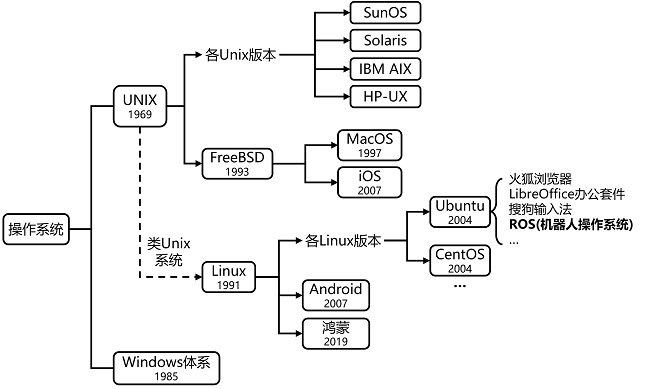
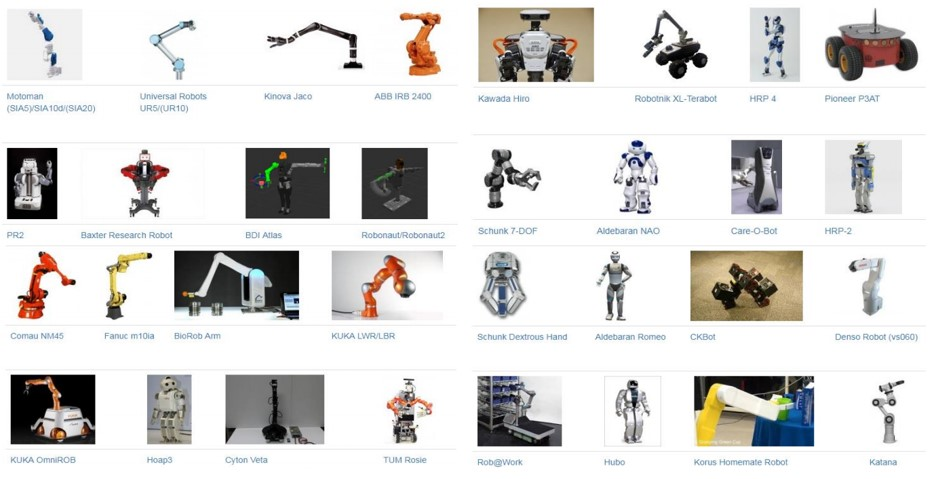
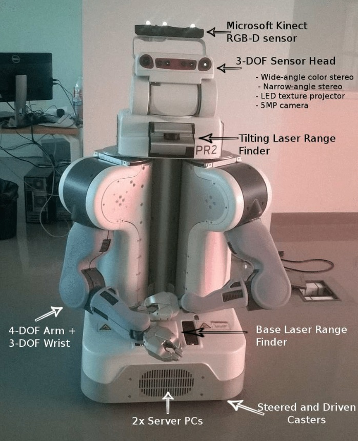
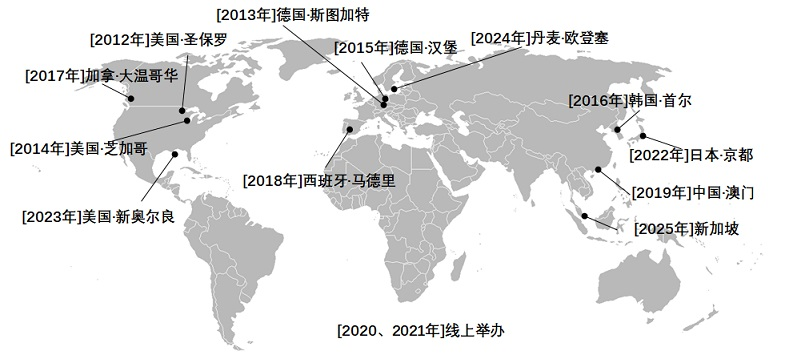
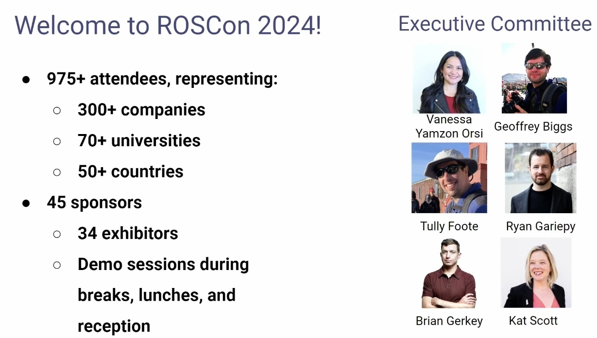
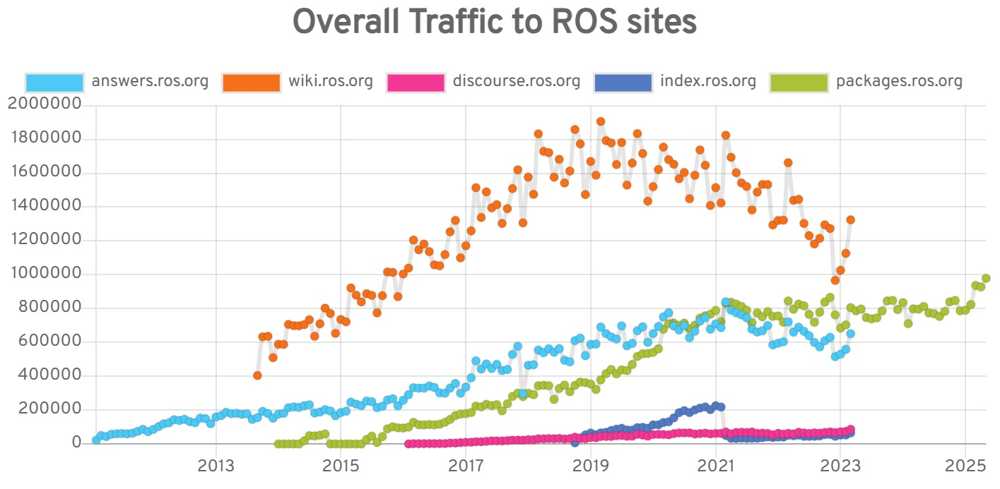
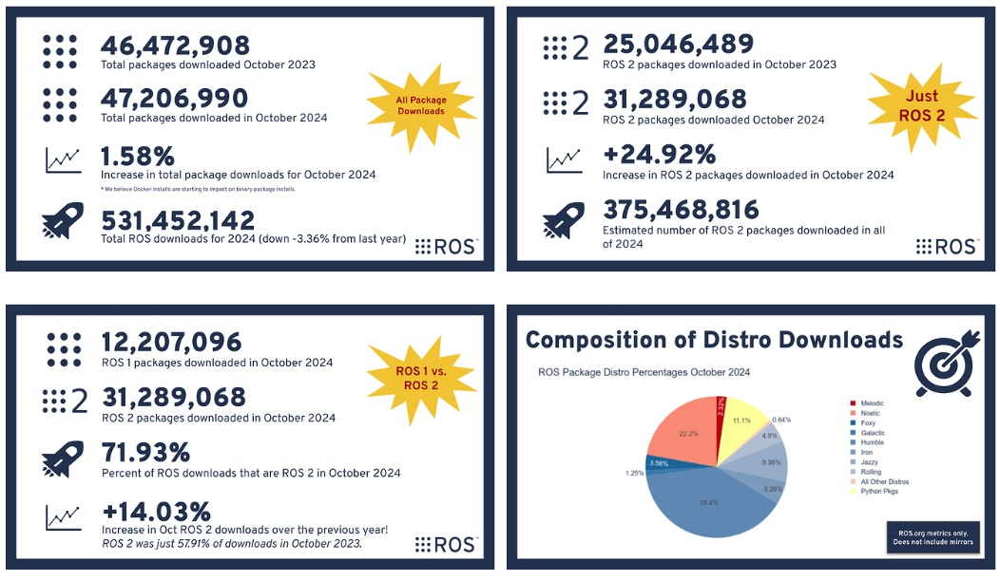

# 1.绪论

近年来，机器人领域取得了举世瞩目的进展。性价比较高的机器人平台，包括地面移动机器人、旋翼无人机和类人机器人等，得到了广泛应用。更令人感到振奋的是，越来越多的高级智能算法让机器人的自主等级逐步提高。

本文主要介绍一个软件平台，即**机器人操作系统（ROS，Robot Operating System）**，它可以帮助提高机器人软件的开发效率。ROS系统的官方定义如下(https://wiki.ros.org/ROS/Introduction)：

>ROS is an open-source, meta-operating system for your robot. It provides the services you would expect from an operating system, including hardware abstraction, low-level device control, implementation of commonly-used functionality, message-passing between processes, and package management. It also provides tools and libraries for obtaining, building, writing, and running code across multiple computers. 
>ROS是面向机器人的开源的元(meta)操作系统。它能够提供类似传统操作系统的诸多功能，如硬件抽象、底层设备控制、常用功能实现、进程间消息传递和程序包管理等。此外，它还提供相关工具和库，用于获取、编译、编辑代码以及在多个计算机之间运行程序完成分布式计算。

*注:之所以称为"元"操作系统，是因为ROS并不是传统意义上的操作系统，如Windows、Android、鸿蒙、iOS、macOS、Ubuntu等。确切的说，ROS其实是安装在某个操作系统上的一个软件平台。虽然Windows和macOS系统也可安装ROS，但Ubuntu支持更好，因此ROS通常会安装在Ubuntu系统上。

<!--https://gitee.com/gaojiao/ros_course.wiki/raw/master/imgs-->
<!--  -->

## 1.1 ROS能解决什么问题

虽然ROS的定义很准确，强调了ROS与传统操作系统的异同，但可能仍然无法让读者抓住ROS的核心要义，尤其是使用ROS能够给机器人软件开发带来哪些优势。一般而言，学习一个新的系统框架，特别是ROS这样复杂多样的框架，往往要耗费大量的时间和精力，因此我们必须确保付出这个代价是有意义的。下面简单列举几个使用ROS能够解决的机器人软件开发问题。

**(1)分布式计算**：现代机器人系统往往需要多个计算机同时运行多个进程，例如：

+ 一些机器人搭载多台计算机，每台计算机用于控制机器人的部分驱动器或传感器；
+ 即使只有一台计算机，通常仍将程序划分为独立运行且相互协作的小的模块来完成复杂的控制任务，这也是常见的做法；
+ 当多个机器人需要协同完成一个任务时，往往需要互相通信来支撑任务的完成；
+ 用户通常通过台式机、笔记本或者移动设备发送指令控制机器人，这种人机交互接口可以认为是机器人软件的一部分。

单计算机或者多计算机不同进程间的通信问题是上述例子中的主要挑战。ROS为实现上述通信提供两种相对简单、完备的机制。

**(2)软件复用**：随着机器人研究的快速推进，诞生了一批应对导航、路径规划、建图等通用任务的算法。当然，任何一个算法实用的前提是其能够应用于新的领域，且不必重复实现。事实上，如何将现有算法快速移植到不同系统一直是一个挑战，ROS通过以下两种方法解决这个问题。

+ ROS标准包（Standard Packages）提供稳定、可调式的各类重要机器人算法实现。
+ ROS通信接口正在成为机器人软件互操作的事实标准，也就是说绝大部分最新的硬件驱动和最前沿的算法实现都可以在ROS中找到。例如，在ROS的官方网页上有着大量的开源软件库，这些软件使用ROS通用接口，从而避免为了集成它们而重新开发新的接口程序。

综上所述，开发人员如果使用ROS，可以将更多的时间用于新思想和新算法的设计与实现，尽量避免重复实现已有的研究结果。

**(3)快速测试**：为机器人开发软件比其他软件开发更具挑战性，主要是因为调试准备时间长，且调试过程复杂。况且，因为硬件维修、经费有限等因素，不一定随时有机器人可供使用。ROS提供两种策略来解决上述问题。

+ 精心设计的ROS系统框架将底层硬件控制模块和顶层数据处理与决策模块分离，从而可以使用模拟器替代底层硬件模块，独立测试顶层部分，提高测试效率。
+ ROS另外提供了一种简单的方法可以在调试过程中记录传感器数据及其他类型的消息数据，并在试验后按时间戳回放。通过这种方式，每次运行机器人可以获得更多的测试机会。例如，可以记录传感器的数据，并通过多次回放测试不同的数据处理算法。在ROS术语中，这类记录的数据叫作包（bag），一个被称为rosbag的工具可以用于记录和回放包数据。

采用上述方案的一个最大优势是实现代码的"无缝连接"，因为实体机器人、仿真器和回放的包可以提供同样（至少是非常类似）的接口，上层软件不需要修改就可以与它们进行交互，实际上甚至不需要知道操作的对象是不是实体机器人。

当然，ROS操作系统并不是唯一具备上述能力的机器人软件平台。ROS的最大不同在于来自机器人领域诸多开发人员的认可和支持，这种支持将促使ROS的未来不断发展、完善、进步。

**对ROS的误解…**：最后，让我们用一点时间来澄清容易对ROS产生的误解，另一个侧面来认识ROS。

+ ROS不是一种编程语言。实际上，ROS的主要代码由C++语言编写，客户端库的编写还可以使用Python、Java、和Lisp等其他多种语言编写。
+ ROS不仅是一个函数库，除包含客户端库（Client Libraries）外，还包含一个中心服务器（Central Server）、一系列命令行工具、图形化界面工具以及编译环境。
+ ROS不是集成开发环境。虽然ROS没有规定软件开发环境，但几乎所有的主流IDE都可用于基于ROS的软件开发。此外，我们还可以根据个人喜好，使用普通的文本编辑器和命令行来完成相应的开发，而无需任何IDE。

`说明：以上内容部分摘自《机器人操作系统浅析》（[美] Jason M. O'Kane著，肖军浩译）`

## 1.2 ROS=通信管道+工具+功能+社区

通过前面的介绍可以知道，尽管ROS名字中包含"OS(操作系统)"，但并不是一个操作系统，而是一个软件开发工具包（SDK），它为机器人应用的开发提供了所需的基础模块。无论是课堂项目、科学实验、研究原型，还是最终产品，ROS都能帮助开发者更高效地实现目标。更重要的是，ROS完全开源，任何人都可以自由使用、修改与贡献，从而推动机器人技术的快速发展与普及。

可以用这个等式描述：**ROS = plumbing(通信管道) + tools(工具) + Capabilities(功能) + community(社区)**。ROS是由**通信管道、工具、功能、社区**共同构成的完整框架。

+ **(1)通信管道(plumbing)**

ROS的核心是一套**消息传递系统**，通常被称为"管道(plumbing)"或"中间件(middleware)"。在开发机器人应用时，通信往往是最先需要解决的问题之一，尤其是在涉及硬件交互的软件系统中。为此，ROS提供了专门的消息传递系统，通过**发布/订阅模式**实现不同节点之间的通信，大大简化了开发者的工作。这种方式不仅节省了通信管理的时间，还自然地推动了良好的软件工程实践，如**故障隔离、关注点分离和接口清晰化**，从而使基于ROS的系统更易于维护、扩展与复用。

与此同时，开发者还可以利用ROS社区长期积累下来的**标准化消息格式**。这些标准广泛应用于机器人各类组件与功能之间的交互，从激光雷达、摄像头等传感器，到定位算法与用户界面，都能够借助这些统一规范实现高效对接。

+ **(2)工具(tools)**

构建机器人应用是一项充满挑战的工作，它不仅包含一般软件开发的复杂性，还需要通过传感器与执行器实现对物理世界的异步交互。要想高效完成开发，离不开完善的开发工具支持。ROS 在这方面提供了丰富的工具集，包括启动管理（launch）、系统监控与自省（introspection）、调试（debugging）、可视化（visualization）、数据绘制（plotting）、日志记录（logging）以及数据回放（playback）等。这些工具不仅能显著加快开发团队的进度，还可以直接集成到产品中随应用一同发布，从而提升系统的可用性与可维护性。

+ **(3)功能(capabilities)**

ROS生态系统堪称一个机器人软件的宝库。无论是激光雷达、GPS等设备驱动，四足机器人行走与平衡控制器，还是移动机器人建图系统，ROS都能提供相应的解决方案。从驱动程序、到算法、再到用户界面，ROS为开发者提供了丰富的构建模块，使其能够将精力集中在应用本身，而不是从零开始搭建底层功能。

ROS项目的目标在于不断提升机器人软件的基础能力水平，从而降低构建机器人应用的门槛。任何拥有一个有价值机器人创意的人，都可以依托ROS将想法变为现实，而无需全面掌握底层硬件与软件的所有细节。

+ **(4)社区(community)**

ROS社区规模庞大、多元且具有全球性。从学生、业余爱好者，到跨国企业与政府机构，各类个人与组织都在共同推动ROS项目的发展。

ROS项目的运营机构是[Open Robotics](https://www.openrobotics.org/)。它不仅运营ROS的共享在线服务（如官方网站），还负责发行版本的创建与管理（包括用户安装的二进制包），并主导开发与维护 ROS 的核心软件。

官方网站 <https://robots.ros.org> 列出了ROS支持的机器人，从机械臂、移动机器人、人形机器人、无人机，到激光雷达、IMU、相机等传感器和执行器，形成了庞大的社区生态。

## 1.3 ROS发展历程

2007年之前，斯坦福大学机器人实验室的博士生Keenan Wyrobek和Eric Berger发现，机器人技术研究总是重复着同样的模式：90%的时间都用来重写别人写过的代码（如传感器、执行器的驱动程序，机器人内部程序间的通信），最多只剩下10%的精力用于创新，也就是所谓的"**重新发明轮子(Re-Inventing the Wheel)**"的问题。

于是，他们制定了一个宏伟的目标，要打造"机器人界的Linux"。为了实现这一愿景，Keenan和Eric离开了斯坦福大学，加入到了由斯坦福大学Scott Hassan教授创立了Willow Garage（柳树车库）公司，这是一家非营利性研究实验室。

+ **(1) Willow Garage时期:2007~2013**

2007年，Willow Garage正式启动了ROS项目。其最初目标是开发一个机器人的基础软平台，提供硬件抽象、底层设备控制、机器人基本功能实现、进程间消息传递和包管理等功能。

2010年，Willow Garage发布ROS Box Turtle版本，这是第一个官方正式版本。Willow Garage将其用于自家的PR2 (Personal Robot 2) 机器人平台，并免费向顶尖研究机构提供了超过10台PR2（当时1台PR2价格高达40万美元），包括弗莱堡大学（德国）、罗伯特博世有限公司、佐治亚理工学院、鲁汶大学（比利时）、麻省理工学院(MIT)、斯坦福大学、慕尼黑工业大学（德国）、加州大学伯克利分校、宾夕法尼亚大学、南加州大学(USC) 和东京大学（日本），这些机构在使用PR2的过程中也极大地贡献和完善了ROS生态。

ROS开始采用以海龟物种名称命名的定期发布计划，相继发布了`C Turtle(2010), Diamondback(2011), Electric(2011), Fuerte(2012), Groovy(2012)`, 每半年或一年发布一个新版本，功能包的数量呈指数级增长，涵盖了感知、规划、控制、仿真等几乎所有机器人技术领域。

2011年是快速发展的一年：ROS Answers问答论坛网站上线；TurtleBot机器人套件大获成功；Willow Garage创建了开源机器人基金会（**OSRF**, Open Source Robotics Foundation）。

2012年，第一届[ROSCon（开发者大会）](https://roscon.ros.org)在美国圣保罗举办，之后ROSCon每年都会举办，来自全球的工业界和学术界的开发者会齐聚一堂，分享自己使用ROS开发的机器人应用，ROS官方也会介绍ROS的发展情况及新特性。

+ **(2) OSRF与Open Robotics时期:2013~至今**

2013年，Willow Garage宣布解散，**OSRF**成为ROS的主要软件维护者。之后，ROS每年都会发布一个新版本，人们对ROS的兴趣也持续增长，许多国家都组织了ROS开发者聚会，出版了大量的ROS书籍。

2017年，OSRF更名为[Open Robotics](https://www.openrobotics.org)，此后ROS由Open Robotics开发维护。

2020年，ROS发布了最后一个ROS1(与ROS2区分)版本：`Neotic`。

ROS的版本命名遵循一种独特而有趣的规律：采用英文字母顺序排列的方式依次命名，每个版本的代号由一个以相应字母开头的`形容词+动物名`组成，例如`Kinetic Kame、Melodic Morenia`等。这一命名方式不仅便于区分版本，还为严肃的机器人软件系统增添了一份轻松与亲和力。

其中，`Indigo、Kinetic、Melodic、Neotic`为**长期支持版本（LTS, Long-Term Support）**。LTS版本相对较稳定，官方支持时间也较长，一般为5年。停止支持的版本并不代表不能用，依然可以运行、开发和部署，只是以后不会再有官方更新（包括安全补丁、依赖适配、功能改进）。

另外，不同的ROS版本只能安装在特定版本的Ubuntu操作系统上。Ubuntu系统每两年发布一个LTS版本，因此ROS也是每两年发布一个LTS版本。

参考：<https://wiki.ros.org/Distributions> 。

| 发布时间 | 停止支持 | Ubuntu 版本 | ROS版本 |
|:-------:|:-------:|:-----------:|:----------:|
| 2010-03 |         | Ubuntu 9.10 Karmic | Box Turtle |
| 2010-08 |         | Ubuntu 10.04 Lucid | C Turtle |
| 2011-03 |         | Ubuntu 10.04 Lucid | Diamondback |
| 2011-08 |         | Ubuntu 11.04 Natty | Electric Emys |
| 2012-04 |         | Ubuntu 12.04 Precise | Fuerte |
| 2012-12 | 2014-07 | Ubuntu 12.04 Precise | Groovy Galapagos |
| 2013-09 | 2015-05 | Ubuntu 12.04 Precise | Hydro Medusa |
| 2014-07 | 2019-04 | Ubuntu 14.04 Trusty  | **Indigo Igloo** |
| 2015-05 | 2017-05 | Ubuntu 15.04 Vivid   | Jade Turtle |
| 2016-05 | 2021-04 | Ubuntu 16.04 Xenial  | **Kinetic Kame** |
| 2017-05 | 2019-05 | Ubuntu 17.04 Zesty   | Lunar Loggerhead |
| 2018-05 | 2023-06 | Ubuntu 18.04 Bionic  | **Melodic Morenia** |
| 2020-05 | 2025-05 | Ubuntu 20.04 Focal   | **Noetic Ninjemys** |

+  **(3) ROS2产生与发展**

ROS在推动机器人研究方面功不可没，但其最初定位于实验与教学环境，导致在工程化应用中存在一定局限，如实时性不足、系统稳定性受限以及对跨平台支持不够全面。随着机器人逐渐走向产业化，对可靠性、安全性和可扩展性的需求愈发迫切。为应对这些挑战，ROS2应运而生，它在继承原有生态的基础上，引入了更先进的通信机制与多平台支持，使其能够更好地满足工业级应用的需求。

早在2014年，OSRF就启动了ROS2项目，彻底重构了通信层，摒弃了roscore和自定义TCP/UDP协议，转而采用**DDS**（Data Distribution Service，数据分发服务）标准，提供了发现机制、可靠性、安全性以及真正的实时性能和分布式能力。

2017年，发布第一个ROS2正式版`Ardent`，之后又相继发布了`Bouncy (2018), Crystal (2018), Dashing (2019), Foxy (2020), Galactic (2021), Humble (2022), Iron (2023), Jazzy (2024), Kilted(2025)`，功能日趋完善和稳定。

参考：<https://docs.ros.org/en/rolling/Releases.html>

| 发布时间 | 停止支持 | Ubuntu 版本         | ROS2版本 |
|:--------:|:-------:|:-------------------:|:--------:|
| 2017-12  | 2018-12 | Ubuntu 16.04 Xenial | Ardent Apalone |
| 2018-07  | 2019-07 | Ubuntu 18.04 Bionic | Bouncy Bolson |
| 2018-12  | 2019-12 | Ubuntu 18.04 Bionic | Crystal Clemmys |
| 2019-05  | 2021-05 | Ubuntu 18.04 Bionic | **Dashing Diademata** |
| 2019-11  | 2020-11 | Ubuntu 18.04 Bionic | Eloquent Elusor |
| 2020-06  | 2023-06 | Ubuntu 20.04 Focal  | **Foxy Fitzroy** |
| 2021-05  | 2022-12 | Ubuntu 20.04 Focal  | Galactic Geochelone |
| 2022-05  | 2027-05 | Ubuntu 22.04 Jammy  | **Humble Hawksbill** |
| 2023-05  | 2024-12 | Ubuntu 22.04 Jammy  | Iron Irwini |
| 2024-05  | 2029-05 | Ubuntu 24.04 Noble  | **Jazzy Jalisco** |
| 2025-05  | 2026-12 | Ubuntu 24.04 Noble  | Kilted Kaiju |

ROS1的最后一个LTS版本Noetic于2020年5月发布，支持到2025，之后即全面进入ROS2时代。

ROS指标报告网站（ROS Metric Report，<https://metrics.ros.org> ）统计了历年来ROS用户数量和访问趋势。可见其wiki网站每月访问量最多时将近**200万**。但是，从2020年开始，ROS wiki的访问量开始下降，这是因为2020年后，ROS社区的重点逐渐从ROS1转向ROS2，ROS2的资料逐渐集中到 <https://docs.ros.org>，而不是原来的 <https://wiki.ros.org> 。

本教程为ROS2开发教程，将以长期支持版的**Ubuntu 22.04 + ROS2 Humble**为例进行讲解。
