# 2.Ubuntu基础

ROS不是一个操作系统，而是一个软件开发工具包（SDK）。前面提到，ROS通常会安装在Ubuntu系统中，因此本章介绍Ubuntu系统的安装及使用方法。

## 2.1 操作系统

### 2.1.1 什么是操作系统

**操作系统**（Operating System）是计算机用户与硬件之间的中介。简单来说，它就是连接计算机硬件与用户的接口。

每台计算机都必须有一个操作系统，才能运行其他程序。操作系统的作用是协调硬件资源在不同系统程序和应用程序之间的使用，为各类用户提供一个环境，使其他程序能够高效完成有用的工作。

操作系统本质上是一个程序集合，它常驻于计算机中，使计算机能够高效运行。它负责处理一些基本任务，例如识别键盘输入、管理磁盘上的文件与目录、在屏幕上显示输出，以及控制外部设备。

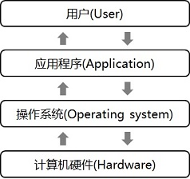

### 2.1.2 操作系统发展历史

+ **(1)操作系统的起源：从批处理到多任务**

早期计算机并无"操作系统"这一概念，程序员通过手工操作物理开关和插拔线缆来直接控制硬件，效率极其低下。

为提升资源利用率，上世纪50年代出现了批处理系统（Batch Processing），这是操作系统的雏形。它通过一个常驻内存的监控程序，自动顺序处理一批作业，减少了人工干预。

60年代，硬件技术（如中断、通道技术）的进步催生了**多道程序**（Multiprogramming）和**分时系统**（Time-Sharing）的概念。

+ **(2)Unix的诞生**

Unix的起源可以追溯到20世纪60年代中期，当时麻省理工学院、贝尔实验室和通用电气正在开发一个名为**Multics**的分时操作系统。

1969年，部分研究人员对Multics的规模和复杂性感到失望，贝尔实验室的**肯·汤普森**(Ken Thompson)和**丹尼斯·里奇**(Dennis Ritchie)等人从该项目中退出，着手开发一个更简洁、更实用的新系统，这就是**Unix**。

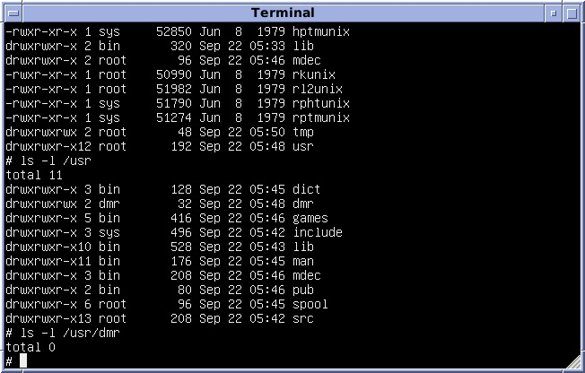


这个新系统最初被称作"**Unics**"，是对"Multics"的戏仿。Multics英文意为"多"，而"Unics"寓意为"单"，体现了新系统追求简单、轻量的设计理念。随着系统逐渐完善，"Unics"的拼写演变成了"Unix"，既保持了原有的谐趣，又简洁易记。

Unix的成功不仅在于其技术实现，更在于其设计哲学。

1. **一切皆文件**：提供了统一的I/O模型，文件是通用的接口载体，无论是存储数据、控制设备还是进行通信，都可以通过操作文件来实现。
2. **提供机制，而非策略**：系统提供基础工具，用户自由组合以实现功能。
3. **小型、单一目的的模块化程序**：程序应专注于一件事并将其做好。
4. **使用文本流作为通用接口**：使得程序之间能够轻松协作。

尤为重要的是，为了提高开发效率，Kenneth Thompson和Dennis Ritchie**发明了C语言**，并于1973年用C语言重写了Unix内核。这使得Unix具备了前所未有的可移植性，得以摆脱特定硬件架构的束缚，为其走向更广阔的平台奠定了基础。如图为Thompson和Ritchie在PDP-11机器上用C语言重新编写Unix。

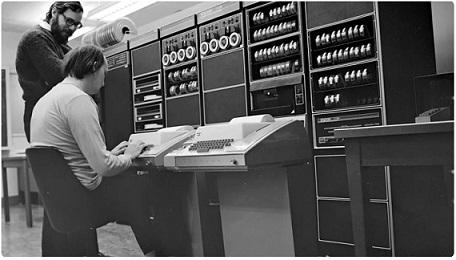

由于反托拉斯法案的限制，Unix首先在学术领域发展。1976-1993年，美国**加州大学伯克利分校**（Berkeley）的研究者从学术角度对Unix进行大系列修改，这就是广为人知的伯克利软件开发**BSD Unix**（Berkeley Software Distribution），它使得Unix具有了TCP/IP等功能代码。

1983年以后，**AT&T**（美国电话电报公司）从商业角度发行了**System V Unix**，它不仅继承了BSD很多功能还加入了更有优势的软件，更适合商业领域。

**System V Unix**和**BSD Unix**诞生后，SUN、惠普、IBM、DEC等公司都在此基础上开发了自己的Unix版本。

为了避免多个Unix版本出现的混乱局面，IEEE计算机协会为维护操作系统之间的兼容性，制定了一套操作系统接口和工具标准，称为**POSIX**（Portable Operating System Interface, 可移植操作系统接口）。

+ **(3)GNU与Linux：开源精神的崛起**

80年代，随着Unix走向商业化闭源，理查德·斯托曼(Richard Stallman)发起了**GNU**（GNU is Not Unix）项目，旨在创建一个完全自由、类Unix的操作系统。GNU项目开发了大量的核心组件（如gcc、glibc、bash等），但唯独缺少一个成熟可用的内核。

1991年，芬兰赫尔辛基大学的大学生Linus Torvalds（李纳斯•托瓦兹）觉得当时教学用的Minix（迷你版UNIX）操作系统太难用了，于是决定自己开发一个全功能的、支持**POSIX标准**的、类Unix的操作系统内核，并将其命名为**Linux**。

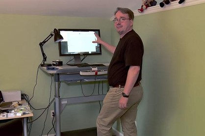

第1版**Linux**于1991年9月发布，当时仅有10000行代码。与Windows及其他有专利权的操作系统不同，Linux开放源代码，任何人都可以免费使用它，因此迅速吸引了全球开发者的参与。这个独立的Linux内核与GNU项目的系统工具库完美结合，形成了一个完整的、可自由使用和修改的操作系统，即**GNU/Linux**系统（通常简称为**Linux**）。

Linus Torvalds独立把这个内核开发到0.02版本，这个版本已经可以运行C语言编译器gcc，bash命令处理器和很少的一些应用程序。这些就是他开始的全部工作，接着在因特网寻求广泛的帮助，由全世界的自由软件开发者共同开发完善。目前linux源代码托管在Github上，地址为 https://github.com/torvalds/linux 。

Linux继承了Unix的设计哲学，并因其开源、协作的开发模式，得以爆炸式发展，衍生出众多不同的**发行版（Distribution）**，以满足各种需求。Linux有上百种不同的发行版，常见的Linux发行版有：Ubuntu、CentOS、Red Hat、Debian、红旗、Fedora等。

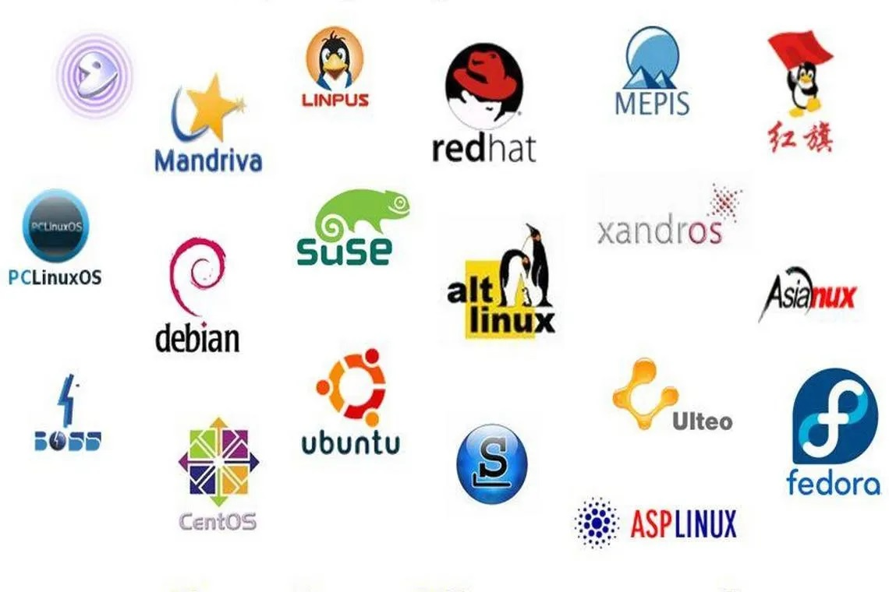

为什么有众多的Linux发行版呢？因为Linux本质上是内核，而完整的操作系统通常由内核、系统工具、库、桌面环境和应用程序共同组成，这些完整的软件集合被称为Linux发行版。发行版通常由不同组织或社区维护，针对不同的应用场景和用户群体进行定制。

### 2.1.3 Ubuntu操作系统

在众多Linux发行版生态中，[Ubuntu](https://ubuntu.com/)是一个基于Debian架构的、以桌面应用为主的GNU/Linux操作系统发行版。其名称源自非洲南部祖鲁语或科萨语中的"ubuntu"哲学概念，意为"人因他人而为人"，完美体现了开源社区共享与协作的精神。

2004年，Ubuntu由南非企业家Mark Shuttleworth创立，并由其总部在伦敦的公司Canonical提供商业支持和维护。Ubuntu的第一个版本（4.10）于2004年10月发布，其创立之初的核心目标是为普通用户提供一个易用、稳定、免费的桌面Linux替代方案。

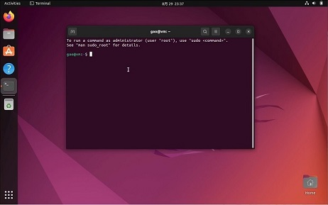

+ **易用性与人性化**

Ubuntu的默认的桌面环境设计简洁直观，即便是刚从Windows或macOS转来的用户也能快速上手。它集成了图形化的软件中心、系统设置和更新管理器，极大降低了Linux的使用门槛。

+ **强大的软件生态**

继承并优化了Debian的包管理工具APT（Advanced Package Tool），用户可以通过apt命令从庞大的软件仓库中安装、更新和删除数以万计的应用程序。比如想要安装git版本管理软件，执行apt install git即可。

+ **定期发布与长期支持（LTS）**

Ubuntu在每年的4月份和10月份发布新版本，版本号由发布年份和月份组成，如Ubuntu 24.10表示2024年10月发布。

在偶数年4月份发布的版本为**长期支持版本**（LTS，Long-Term Support），如18.04 LTS、20.04 LTS、22.04 LTS、24.04 LTS。LST版本提供长达**5年**的免费安全与维护更新，对于Ubuntu Server版甚至可达10年，是企业部署和生产环境的首选。各版本支持期限可查看其官网 https://ubuntu.com/about/release-cycle 。

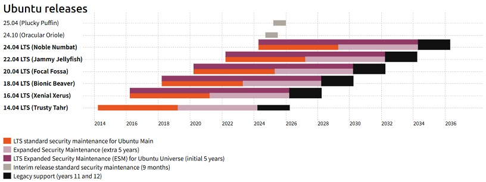

### 2.1.4 为什么不用Windows系统

在操作系统的发展谱系中，微软的Windows系统走的是一条与Unix/Linux截然不同的道路。Windows系统起源于MS-DOS（1981），凭借图形界面（GUI）与商业软件绑定（如Office）主导个人电脑市场。经过数十年的迭代，Windows NT内核（现为Windows内核）成为现代Windows系统的基石。因此，Windows与Unix/Linux（包括Ubuntu）在技术实现、内核架构、系统API和哲学理念上构成了两条主要的、并行发展的计算生态。

Windows在**桌面操作系统**市场长期占据主导地位；而Linux则在**服务器、云计算、高性能计算及开发环境**中成为主流。

近年来，微软推出的Windows Subsystem for Linux (WSL)，特别是WSL2，允许用户在Windows系统上无缝运行完整的Linux内核及其用户空间，这意味着开发者可以在Windows桌面上直接获得一个高性能的Ubuntu（或其他发行版）命令行环境，无需双启动或虚拟机。这一举措不仅体现了微软对Linux生态的拥抱，也侧面印证了Linux在软件开发领域不可撼动的地位。

对于软件开发而言，选择合适的操作系统环境至关重要。虽然Windows拥有强大的图形界面和丰富的应用软件，但**Linux/Ubuntu**在开发工作流中具有更大的优势，具体表现在：

+ **(1)开发环境与工具链**

绝大多数现代编程语言（如Python, C/C++, Node.js, Go）、开源数据库（如MySQL, Redis）、中间件和开发工具都诞生或首要运行于Unix/Linux环境。在Ubuntu上配置这些环境通常更为直接，只需几条终端命令即可从官方仓库安装，避免了在Windows中手动下载安装包、配置路径和环境变量的繁琐过程。编译器（GCC/G++）、构建工具（Make, CMake）和脚本Shell（Bash）等都是其原生组成部分。

+ **(2)包管理系统**

Ubuntu继承自Debian的APT（Advanced Package Tool）包管理系统是其核心优势之一。它提供了由数万个经过严格测试和依赖关系解析的软件库。开发者可以轻松地安装、更新、卸载软件及其所有依赖，保证环境的一致性和可复现性。这与Windows上分散的安装方式（各种exe/msi安装包）形成鲜明对比。

+ **(3)命令行与脚本能力**

Linux的Bash Shell及其庞大的核心实用程序（grep, awk, sed, find, ssh等）共同构成了一个极其强大和高效的自动化工具箱。开发、调试、部署、日志分析、系统监控等任务可以通过脚本自动化完成，极大提升了开发效率和可靠性。虽然Windows推出了PowerShell和Terminal进行改进，但Unix风格命令行的丰富生态和一致性体验仍遥遥领先。

+ **(4)与生产环境一致**

绝大多数服务器和云平台（如AWS, Google Cloud, 腾讯云, 华为云, 阿里云）都运行Linux操作系统。在Ubuntu桌面环境下进行开发，可以构建一个与最终部署的生产环境高度一致甚至完全相同的系统环境。这避免了因操作系统差异导致的“在我本地是好的”这类经典问题，是实现DevOps和持续集成/持续部署（CI/CD）的理想基础。

+ **(5)定制性与控制力**

开源的本质赋予开发者对系统的完全控制权。从内核参数调优到桌面环境的每一处细节，都可以根据开发需求进行定制。这种透明度和灵活性对于需要深度优化环境的高性能计算、嵌入式开发或系统级编程至关重要。

+ **(6)社区与开源生态**

Ubuntu背后拥有庞大的开源社区和丰富的在线资源。任何遇到的问题几乎都可以通过社区论坛、问答网站和详尽的文档找到解决方案。这种集体智慧的支持是闭源系统难以提供的。

总而言之，Windows是一个优秀的通用消费级桌面操作系统，而Ubuntu则是一个为效率和自动化而生的、面向开发者和技术专家的平台。在接下来的章节中，我们将具体介绍如何安装和配置Ubuntu系统。

## 2.2 Ubuntu的虚拟机安装方法

由于大多数用户的计算机为Windows系统，在安装Ubuntu系统时，通常面临3种选择：**单系统、双系统、虚拟机**安装。

**单系统**安装是指将Ubuntu系统独占计算机进行安装，需要彻底删除Windows系统。**双系统**安装是指在计算机上同时安装Windows系统和Ubuntu系统，开机时选择进入哪个系统。**虚拟机**安装是指在Windows系统中先安装虚拟机软件（如VirtualBox、VMWare等），在虚拟机软件中安装Ubuntu系统。

初学者一般采用**虚拟机**方式安装，虽然会牺牲一定的性能，但其安全性好、容错率高，发生错误不会对宿主系统产生影响，删掉重装即可。

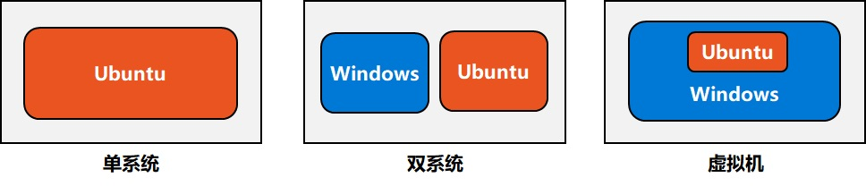

### 2.2.1 VirtualBox虚拟机软件

VirtualBox是一个功能强大、性能优异且完全免费的开源虚拟机软件，由甲骨文公司（Oracle Corporation）持续维护与开发。官方网址为 https://www.virtualbox.org 。

本教程安装版本为**VirtualBox-7.1.6**，其下载地址为（约120MB）：
https://download.virtualbox.org/virtualbox/7.1.6/VirtualBox-7.1.6-167084-Win.exe

为了支持在虚拟机中使用USB等功能，还需安装扩展包（Extension Pack），注意其版本要与VirtualBox版本一致，下载地址为（约22MB）：
https://download.virtualbox.org/virtualbox/7.1.6/Oracle_VirtualBox_Extension_Pack-7.1.6.vbox-extpack

两个文件下载完成后，先双击`VirtualBox-7.1.6-167084-Win.exe`文件安装VirtualBox，然后双击`Oracle_VirtualBox_Extension_Pack-7.1.6.vbox-extpack`安装扩展包。

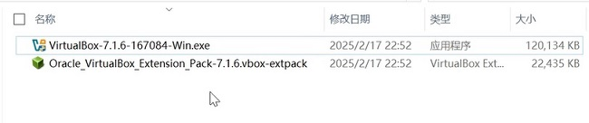

### 2.2.2 Ubuntu虚拟机安装

进入Ubuntu官网下载地址 https://releases.ubuntu.com， 选择22.04.5版本，下载[64-bit PC (AMD64) desktop image](https://releases.ubuntu.com/22.04/ubuntu-22.04.5-desktop-amd64.iso)桌面版（文件大小4.4G）。下载后得到**ubuntu-22.04.5-desktop-amd64.iso**镜像文件。

**（1）新建虚拟机**

+ 点击VirtualBox主界面的`新建`按钮。

+ 指定虚拟机名称，如：`Ubuntu 22.04`。

+ 设置虚拟机安装路径，默认路径为`C:\Users\<用户名>\VirtualBox VMs`，也可选择其它路径，需保证硬盘剩余空间大于30GB。

+ 选择下载的`ubuntu-22.04.5-desktop-amd64.iso`镜像文件。

**（2）虚拟机硬件资源配置**

+ 内存大小：根据主机内存情况，不少于2GB，不高于主机总内存的一半。例如，对于8G内存的主机，可以设置为`4GB`。

+ 处理器：分配至少2个CPU核心，建议`4个`。

+ 虚拟硬盘：设置大小为25~50G，如`40GB`。不要勾选"预先分配全部空间"，这样一开始虚拟硬盘并不会真的占用40GB空间。刚装完Ubuntu 22.04大小约15GB，在使用过程中会动态增长，最大到40GB。

+ 显示设置：将显存调整为`128MB`或更高。

 **（3）安装Ubuntu**

+ 选择新创建的虚拟机，点击`启动`按钮，选择`Try or Install Ubuntu`选项。系统将从ISO镜像启动，显示Ubuntu 22.04安装界面。

+ 选择语言为`English`，点击`Install Ubuntu`，选择键盘布局，默认一般为"English (US)"。

+ 选择"Minimal installation"（最小安装），这样只安装浏览器和基础软件，不会安装办公软件、小游戏等，这些做开发都用不到。

+ 如果勾选"Download updates while installing Ubuntu"，系统安装过程中会自动联网获取最新更新。为了提高安装速度，也可先不勾选，装完系统后再自己更新系统。

+ 选择"Install third-party software..."以安装显卡等硬件驱动以及额外的媒体编解码器。

+ 磁盘分区方案，选择"Erase disk and install Ubuntu"，由于是虚拟机安装操作系统，清除硬盘并不会对主机产生影响，因此可放心选择此选项。

+ 选择所在时区，可通过地图点击选择，推荐选择Shanghai。

+ 创建管理员账户，输入你的名字、主机名（可自定义）、用户名（可以与前面你的名字一致）、密码及确认密码。建议密码尽量简短，因为以后执行终端命令时，会经常输入密码。登录方式默认"Require my password to log in"，也就是每次登陆系统需要输入密码。

+ 开始安装，期间保持网络畅通，大约需要20分钟。

### 2.2.3 系统更新与升级

Ubuntu的安装镜像（ISO文件）是在特定日期刻录的快照。这意味着镜像中包含的所有软件包版本都固定在该时间点。例如，从Ubuntu 22.04镜像下载网站（https://releases.ubuntu.com/22.04） 查看，当前的最新版是22.04.5，镜像文件的日期为2024年9月11日（`ubuntu-22.04.5-desktop-amd64.iso`）。

在镜像发布之后，至用户实际安装系统之前的这段时间里，全球的安全研究人员和开发者会持续不断地发现软件中的新安全漏洞（CVE）并发布相应的补丁。**Ubuntu 22.04**是一个长期支持(Long-TermSupport)版本，这意味着它将得到长达五年的支持，从2022年第一次发布，直到2027年停止支持。

Ubuntu系统是基于Debian的Linux发行版，使用APT（高级包工具，Advanced Package Tool）进行软件安装、更新、升级和卸载。依次执行以下两条命令进行软件的更新和升级：

```
sudo apt update
sudo apt upgrade
```

+ **更新命令：apt update**

主要功能：从软件包**源服务器**中获取数据，更新本地软件包索引（源服务器配置信息存储在 `/etc/apt/sources.list` 文件和 `/etc/apt/sources.list.d/` 目录下的文件中）。执行后不会对系统上已安装的任何软件进行更改、安装或删除，只是同步软件包索引信息。

在更新系统或安装软件之前，需要先执行**apt update**。如果不先执行此命令，APT将基于过时的本地索引信息进行操作，无法知晓软件是否有新版本可用，从而可能错过关键的安全更新或功能增强。

+ **升级命令：apt upgrade**

在**apt update**刷新了可用软件包列表之后，**apt upgrade**命令的功能是实际执行已安装软件包的升级过程。它会计算当前系统上已安装的软件包与本地缓存中可用新版本之间的差异，并自动处理所有可用的升级。

### 2.2.4 安装增强功能

虚拟机操作系统安装完成后，还需要继续安装增强功能。

增强功能（Additions）是一套专为客户机（此处为Ubuntu）操作系统设计的驱动程序和系统应用程序的集合。通过安装特定的底层驱动和服务，显著提升客户机操作系统的性能、功能性与主机系统的集成度。

例如，在未安装增强功能时，虚拟机通常被限制在较低的分辨率，无法调整窗口大小，安装增强功能后，虚拟机可以设置自定义分辨率，进行虚拟机窗口尺寸调整。另外，增强功能还支持在主机和客户机之间启用双向的剪贴板共享，用户可以在主机上复制文本、文件，并直接在客户机中粘贴，反之亦然。

**(1)安装编译工具**

增强功能的安装过程涉及编译内核模块。因此，必须安装基本的编译工具：build-essential，包含了gcc编译器、make工具等开发所需的基础软件包集合。

```
sudo apt install build-essential
```

**(2)安装内核管理工具**

dkms（Dynamic Kernel Module Support）：允许在主机内核升级后，自动为第三方内核模块（如VirtualBox增强功能）重新编译和安装相应版本，从而确保增强功能在系统更新后仍能持续正常工作。

```
sudo apt install dkms
```

**(3)挂载增强功能镜像**

VirtualBox 将增强功能的安装镜像文件（.iso）作为虚拟光驱提供给客户机。
点击`"设备"->"安装增强功能"`可自动装载虚拟光驱。

打开虚拟光驱，可以看到里面有VBoxLinuxAdditions.run、VBoxWindowsAdditions.exe、VBoxDarwinAdditions.pkg等文件，由名字可以看出，它们分别是针对不同操作系统（Linux/Windows/macOS）的增强功能安装文件。由于我们的虚拟机是Ubuntu(Linux)操作系统，所以需要运行VBoxLinuxAdditions.run。

+ 第一种安装方式是右键点击该文件，在弹出的菜单中点击`Run as a Program`即可。

+ 第二种安装方式是通过终端（Terminal）安装。首先右键点击虚拟光驱文件夹的空白处，选择`Open in Terminal`，在终端里打开此文件夹。执行`ls`命令查看当前文件夹中的文件，确保`VBoxLinuxAdditions.run`文件存在。然后执行`sudo ./VBoxLinuxAdditions.run`进行安装。

安装后，可以发现虚拟机窗口大小变得可调整。

最后记得右键光盘图标，点击**Eject（弹出）**。

**(4)共享粘贴板**

为方便与虚拟机间相互拷贝内容，选择`"设备"->"共享粘贴板"->"双向"`。
需要关机，重新启动系统，使配置生效。

可以在Windows中复制一段文字，粘贴到Ubuntu虚拟机中，验证是否成功。

## 2.3 Ubuntu基本使用方法

### 2.3.1 Ubuntu桌面环境

登录Ubuntu系统后，我们会看到Ubuntu桌面，采用的是GNOME桌面环境，看以看到包括顶部的任务栏、左侧的应用程序栏，以及桌面部分。

**（1）顶部任务栏**：最左侧是"**Activities(活动)**"按钮，点击此图标（或按Win键）可进行窗口切换、搜索应用程序。最右侧是系统状态区域，显示网络连接、声音、电量等系统状态，点击后可快速调出快捷设置面板，用于打开系统设置、关机/重启等。

**（2）应用程序栏**：位于屏幕左侧（可设置为自动隐藏或调整位置），是用户快速启动和管理应用程序的核心区域。用户可将常用应用如Firefox浏览器、文件管理器、Terminal终端等锁定于此（右键->Add to Favorites），实现一键启动。底部左下角为显示应用程序图标，点击后会列出所有已安装的应用程序列表，也可输入搜索。

**（3）系统设置**：图形化界面的系统控制中心，用于配置绝大部分硬件和桌面环境，有多种启动方式，既可以可通过点击Activities（或按Win键）搜索"Settings"，也可以点击右上角系统状态区域，选择"Settings"。主要配置包括：网络 (Network)、蓝牙 (Bluetooth)、显示 (Display)、声音 (Sound)、电源 (Power)、隐私 (Privacy)、背景 (Background)、外观 (Appearance)等，为不熟悉命令行的用户提供了直观的系统管理入口。

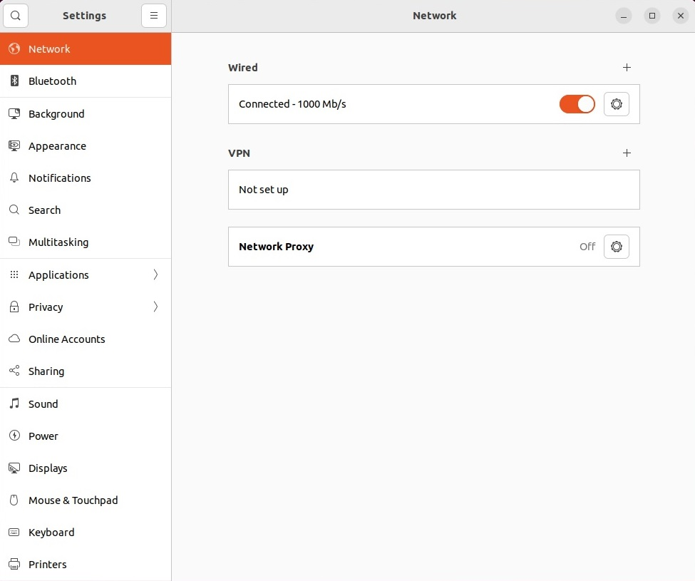

上述所有图形化界面元素（按钮、菜单、设置项）本质上是对底层系统命令和配置文件的图形化封装。每一个图形操作背后都对应着一个或一组具体的命令或对特定配置文件的修改。

### 2.3.2 终端与命令提示符

**终端 (Terminal)** 提供了直接访问操作系统内核和服务的命令行接口。**终端**有很多名字，也可以称为命令行（command line）、控制台（console），或者shell。通过终端，用户可以：

+ 实现比GUI更精细、更强大的控制。

+ 编写脚本，自动化复杂的系统管理任务。

+ 在无图形界面的服务器环境中管理系统。

+ 深入排查和解决GUI工具无法处理的系统问题。

启动一个终端，有以下多种方式：

+ 在应用列表中输入terminal（或cmd、prompt、shell）的前几个字母，选择Terminal终端启动器。开发人员已经为启动器设置了所有最常见的同义词，因此可以轻松找到它。

+ 使用`Ctrl-Alt-T`快捷键启动终端。这种方式不用鼠标，可以快速唤出终端。

+ 在某个文件夹（或桌面）空白处，右键鼠标，点击`Open in Terminal`在终端中打开。这种方式的好处是，打开终端后其工作目录即为当前文件夹。

+ 将终端固定到屏幕左侧的应用程序栏（右键->Add to Favorites）后，可点击图标打开。

无论如何启动终端，都会看到一个闪烁着光标等待输入的窗口，如下图所示。根据Linux系统的不同，窗口颜色、文本内容可能有所不同，但带有文本区域的窗口总体布局应该类似。

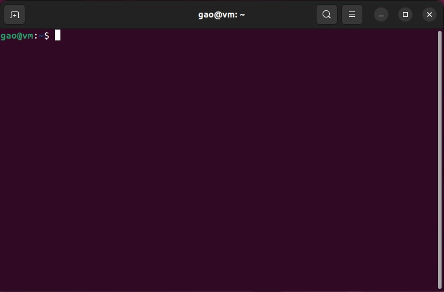

其中，以`$`符号结尾的这段文本称为**命令提示符**。命令提示符通常遵循以下格式：

`<用户名>@<主机名>:<当前工作目录>$`

+ **用户名**：当前登录的用户名。由于一台计算机可以有多个用户，它表示当前正在以哪个用户的权限执行命令。

+ **主机名**：正在操作的计算机名称。远程登录多台机器时，能有效防止误操作到错误的机器上。

+ **当前工作目录**：即当前所在路径。此时，当前工作目录为`~`，这个符号表示当前用户的**家目录**，即`/home/<用户名>`，类似于Windows系统中的`C:\Users\<用户名>`。

+ `$`：提示符符号，分为`$`和`#`两种。`$`表示当前是以普通用户权限在操作；`#`表示当前是以超级用户（root）权限在操作，类似Windows中的"以管理员身份运行"。

**命令提示符**时刻提醒**我是谁？**（用户名）、**我在哪台机器上？**（主机名）、**我在文件系统的什么位置？**（当前目录）以及**我有多大权力？**（`$`或`#`）。

在**命令提示符**后面输入命令后，按回车可运行。例如，可输入以下命令运行测试：

```
pwd
```

会打印出当前的工作目录`/home/<用户名>`（即`~`）。

运行命令时，它产生的任何输出通常都会直接打印在终端中，完成后会继续显示**提示符**。有些命令可以输出大量文本，而有些命令则会静默运行，根本不会输出任何内容。如果运行命令后立即出现另一个**提示符**，请不要惊慌，因为这通常意味着命令执行成功。回想一下20世纪70年代终端的缓慢网络连接，那些早期的程序员认为，如果一切顺利，他们不妨选择不输出任何信息，以节省一些宝贵的数据传输字节。

### 2.3.3 Linux目录结构

在介绍Linux常用命令前，我们先看一下Linux的目录结构。

在Windows系统中，每个驱动器都用字母表示，例如主硬盘驱动器通常为`C:`。而类Unix系统不会这样划分驱动器。相反，它们拥有一个统一的文件系统，各个驱动器可以挂载（mounted）到文件系统中任何合适的位置。

`/`目录通常称为**根目录**，是该统一文件系统的基础。从这里开始，其他所有内容都分支出来，形成一个由目录和子目录组成的树状结构。因此，目录就相当于Windows中的文件夹，目录中存放的既可以是文件，也可以是其他的子目录，而文件中存储的是真正的信息。

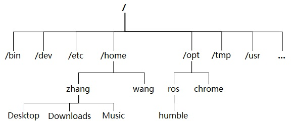

+ `/`：整个文件系统的根目录，所有其他目录和文件的起点。
+ `/bin`：存放二进制可执行文件(`ls`, `mkdir`, `cat`等)，常用命令一般都在这里。
+ `/dev`：用于存放设备文件。在 Linux 中，**"一切皆文件"**，硬件设备也通过文件访问。
+ `/etc`：存放系统管理和配置文件。
+ `/home`：存放所有用户文件的家目录。每个用户有一个以其用户名命名的子目录，比如用户"`zhang`"的主目录（也称`家目录`）就是`/home/zhang`，可以用`~`表示当前用户家目录（`/home/zhang`）。
+ `/opt`：存放第三方可选的附加应用程序包。如搜狗输入法、Chrome浏览器、ROS等都安装到这里。
+ `/tmp`：存放系统和应用程序使用的临时文件。
+ `/usr`：用于存放系统应用程序，比较重要的目录`/usr/local`本地系统管理员软件安装目录（安装系统级的应用）。这是最庞大的目录，要用到的应用程序和文件几乎都在这个目录。
+ `/mnt`：系统管理员安装临时文件系统的安装点，系统提供这个目录是让用户临时挂载其他的文件系统。
+ `/lib`：存放跟文件系统中的程序运行所需要的共享库及内核模块。共享库又叫动态链接共享库，作用类似Windows里的`.dll`文件，存放了根文件系统程序运行所需的共享文件。

另外，还有几个特殊目录：

+ `.`和`..`：在文件系统中，有两个特殊的目录，一个是用户所在的工作目录，即**当前目录**，可用一个点`.`表示；另一个是当前目录的上一层目录，也叫**父目录**，用两个点`..`表示。

+ `~`：表示**当前用户**的**家目录**，即`/home/<用户名>`，类似于Windows系统中的`C:\Users\<用户名>`。

+ `-`：表示`上一个`工作目录，是指切换到这个目录之前所在的那个目录。

### 2.3.4 Linux主要命令

在终端中输入命令、运行并打印结果，是Linux的常用操作，下面我们将详细介绍Linux的主要命令。

**(1) pwd命令**

`pwd`命令即打印工作目录（**P**rint **W**orking **D**irectory）的缩写，其功能是打印出shell当前的工作目录。什么是工作目录呢？

需要理解的一个重要概念是，shell有一个默认位置的概念，任何文件操作都会在这个位置进行，这就是它的工作目录。如果尝试新建文件或目录、查看现有文件，甚至删除文件，shell都会假定在当前工作目录中查找，除非另行指定。因此，随时了解shell所处的目录非常重要，毕竟，从错误的目录中删除文件可能会造成灾难性的后果。如果有任何疑问，可执行pwd命令查看当前的工作目录。

**(2) cd命令**

`cd`（**C**hange **D**irectory）命令用于改变当前工作目录，它是用户在命令行环境下浏览和导航文件系统结构的主要工具。没有图形界面中的鼠标点击，`cd`命令就是用户在终端中穿梭于各个文件夹的"方向盘"。

`cd`命令的语法为（`[ ]`内的项目表示可选，可以输入也可不输入）：

```
$ cd [目录路径]
```

目录路径可以是绝对路径或相对路径。如果不输入目录路径，则切换到当前用户的家目录。


| 命令示例 | 功能描述 | 适用场景 |
|:-------|:--------:|:--------:|
| `cd`| 快速返回当前用户的家目录 | 在任何位置想要"回家"时 |
| `cd ~` | 快速返回当前用户的家目录 | 在任何位置想要"回家"时 |
| `cd ~/xx` | 切换到家目录下的xx目录下 | 想回到家目录的子目录时 |
| `cd /xx/yy` | 使用完整路径精确切换到目标目录 | 明确知道目标目录的完整路径时 |
| `cd aa/bb`<br>`或cd ./aa/bb`| 以当前目录为起点进行相对跳转 | 在当前目录的子目录或附近目录间导航 |
| `cd ..` | 返回上一级目录(父目录) | 需要向上层级导航时 |
| `cd -` | 返回上一个目录 | 需要频繁在两个目录间来回操作时 |

假设某系统当前目录结构如下:

```
/
├── home/
│   └── zhang/
│       ├── Desktop/
│       │   └── project/
│       ├── Downloads/
│       └── Pictures/
├── etc/
├── var/
└── usr/
```

```
1. 回家目录
$ cd
或者
$ cd ~

2. 切换到project
$ cd /home/zhang/Desktop/project
或者
$ cd ~/Desktop/project

3. 使用相对路径（假设当前在/home/zhang）
$ cd Desktop/project

4. 切换到上一级目录 (..)
当前在 /home/zhang/Desktop/project
$ cd ../..
当前目录: /home/zhang
$ cd ..
当前目录: /home

5. 使用cd -切换回上一个目录
当前在 /home/zhang/Desktop
$ cd /etc
当前目录: /etc
$ cd -
当前目录: /home/zhang/Desktop
$ cd -
当前目录: /etc
```

**使用Tab键补全**

输入路径时，按下 Tab 键可以让 Shell 自动补全目录名。如果有多项选择，按两次 Tab 会列出所有可能的选择。这是防止拼写错误和提高效率的最重要习惯。

```
$ cd /h[Tab] → 自动补全为 /home/
$ cd /home/z[Tab] → 自动补全为 /home/zhang/
$ cd D[Tab] → 如果当前目录下只有 `Desktop` 和 `Downloads`，按两次Tab会列出这两个文件夹。
```

在执行其它Linux命令时，如果命令较长，也可利用Tab补全，如：

```
$ sudo apt ins[Tab] → 自动补全为 sudo apt install
$ sudo apt install build-e[Tab] → 自动补全为 sudo apt install build-essential
```

**(3) ls命令**

`ls` (List) 命令是 Linux 中最基础、使用最频繁的命令之一。功能是列出目录中的文件和子目录信息，以供用户查看文件系统内容，是进行所有文件操作（如复制、删除、移动）的前提。

`ls`命令的语法为：

```
$ ls [选项] [文件或目录]
```

`[选项]`：用于控制显示格式、排序方式、显示内容等的参数，常用选项如下表所示；
`[文件或目录]`：指定要查看的一个或多个文件或目录的路径。可以同时查看多个目标，用空格分隔。如果省略参数，则默认为当前工作目录（`.`）。

|选项	|全称/释义	| 功能描述 |
|:-----:|:--------:|:--------:|
|-a     | --all	        |显示所有文件，包括以点（.）开头的隐藏文件。|
|-l     | --long	    |使用长格式列出详细信息，包括权限、所有者、大小、修改时间等。|
|-h     | --human-readable	|与 -l 结合使用，以人类易读的格式（如 K, M, G）显示文件大小。|
|-t     | 	            |按修改时间排序，最新的文件在前。|
|-r     | --reverse	    |反向排序。与其他排序选项（如 -t）结合使用，可倒序显示结果。|
|-S     | 	            |按文件大小排序，最大的文件在前。|
|-R	    |--recursive	|递归列出所有子目录中的内容。|
|-d    	|--directory	|将目录本身像文件一样列出，而不是列出其内容。常与 -l 连用查看目录属性。|
|-i	    |--inode	    |显示每个文件的 inode 编号。|

+ **示例1**：`ls`什么参数都不加，则列出**当前目录**下的所有非隐藏文件和目录。

```
$ ls
Desktop  Documents  Downloads  Music  Pictures ...
```

+ **示例2**：显示所有文件（包含隐藏文件）。在Linux下，隐藏文件均以`.`开头，如`.bashrc`。

```
$ ls -a
.   ..   .bashrc   .profile   Documents   Downloads   Music
```

+ **示例3**：长格式列表（最常用组合）。使用 `-l` 选项获取详细信息，结合 `-h` 选项使文件大小易读。

```
$ ls -lh
total 32K
drwxr-xr-x 2 user user 4.0K Apr 10 14:30 Documents
drwxr-xr-x 2 user user 4.0K Apr 10 14:30 Downloads
-rw-r--r-- 1 user user  12K Apr 10 15:22 report.pdf
-rwxr-xr-x 1 user user  845 Apr 10 14:45 readme.txt
```

+ **示例4**：按不同方式排序。

```
按修改时间排序，最新修改的文件在前
$ ls -lt

按文件大小排序，最大的文件在前
$ ls -lS

反向排序，按字母逆序排列
$ ls -lr
```

+ **示例5**：查看目录本身而非其内容。

```
如果想查看 /usr 这个目录本身的属性，而不是看它里面有什么
$ ls -ld /usr
drwxr-xr-x 142 root root 12288 Apr 11 19:06 /usr
```

+ **示例6**：组合选项。实际使用中，选项总是被组合在一起。

```
最常用的组合：以长格式、易读大小、显示所有文件（包括隐藏文件）
$ ls -alh

查看所有文件详细信息，并按时间排列
$ ls -lht
```

在许多 Linux 发行版中，ls 命令通常被设置了别名，使默认行为更友好（一般在`.bashrc`文件中设置）。可以用`alias`命令查看系统为 ls 设置了什么别名。

```
$ alias ls
alias ls='ls --color=auto'  # 最常见的别名，自动彩色输出
```

**(4) mkdir命令**

`mkdir` (**M**a**k**e **Dir**ectory) 命令用于在文件系统中创建一个或多个新的目录（文件夹）。它是构建和组织目录结构的基础工具，与 `cd` 和 `ls` 等命令协同工作，共同完成文件系统的管理和导航。

`mkdir`命令语法为：

```
$ mkdir [选项] 目录名
```

`[选项]`：用于修改命令行为的参数，最常用的选项是`-p`，可以递归创建目录，如果路径中的父目录不存在，则会一并创建，且不会报错。

`目录名`：指定要创建的一个或多个目录的名称路径。可以同时创建多个目录，用空格分隔。路径可以是绝对路径，也可以是相对路径。


+ **示例1**：在当前目录或指定路径下创建一个新目录。

```
在当前工作目录下创建一个名为 'dir1' 的目录
$ mkdir dir1

使用绝对路径在 /tmp 下创建一个名为 'dir2' 的目录
$ mkdir /tmp/dir2
```

+ **示例2**：同时创建多个目录。

```
在当前目录下同时创建 'dir1', 'dir2', 'dir3' 三个目录
$ mkdir dir1 dir2 dir3

在指定路径下创建多个目录
$ mkdir ~/Desktop/dir1 /tmp/dir2
```

+ **示例3**：使用 -p 选项创建嵌套目录。如果不使用 -p 选项，且父目录不存在，命令会报错。

```
创建一整个项目结构。如果 project 或 script 不存在，也会被创建
$ mkdir -p project/src/python
```

**(5) mv命令**

`mv` (Move) 命令用于移动文件和目录，或者用于重命名。在 Linux 中，重命名被视为将文件移动到同一个目录下的新名称。

`mv`命令语法为

```
$ mv [选项] 源文件或目录 目标文件或目录
```

比较常用的选项为`-i`选项，加入此选项后，如果目标文件已存在会提示确认，防止数据被覆盖。确定覆盖则输入`y`确认。

+ **示例1**: **重命名**文件/目录 (源和目标路径的目录部分相同)

```
将 file1.txt 重命名为 file2.txt
$ mv file1.txt file2.txt

将目录 dir1 重命名为 dir2
$ mv dir1 dir2
```

+ **示例2**: **移动**文件/目录 (源和目标路径的目录部分不同)

```
将 file1.txt 移动到 /tmp/ 目录下
$ mv file1.txt /tmp/

将多个文件移动到另一个目录
$ mv file1.txt file2.pdf ~/Documents/

将目录 dir1 及其内部所有内容移动到 /opt/ 下
$ mv dir1 /opt/
```

+ **示例3**:  **移动并重命名** (结合上述两种操作)

```
将 ~/Downloads/file.zip 移动到 /opt/ 并重命名为 program.zip
$ mv ~/Downloads/file.zip /opt/program.zip
```

**(6) cp命令**

`cp` (Copy) 命令用于复制文件或目录。它与 `mv` 语法相似，但保留源文件。

`cp`命令语法为

```
$ cp [选项] 源文件或目录 目标文件或目录
```

在复制目录时，必须使用`-r`（recursive，递归）选项，否则会复制失败。

+ **示例1**: 复制文件

```
复制 file1.txt 到 file2.txt (在当前目录)
$ cp file1.txt file2.txt

复制 file.txt 到 /tmp/ 目录下（保留原文件名）
$ cp file.txt /tmp/
```

+ **示例2**: 复制目录 (必须使用`-r`选项)

```
递归复制整个dir1目录到 ~/Documents/
$ cp -r dir1 ~/Documents/
```

+ **示例3**: 复制多个文件

```
复制多个文件到一个目标目录
$ cp file1.txt file2.jpg ~/Documents/
```

**(7) rm命令**

`rm` (Remove) 命令用于永久删除文件和目录。这是一个**非常危险**的命令，删除后通常无法恢复。

`rm`命令语法为

```
$ rm [选项] 文件或目录
```

在删除目录时，必须使用`-r`（recursive，递归）选项，否则会删除失败。另外，添加`-f`选项表示强制删除，会忽略不存在的文件，不提示确认。

+ **示例1**: 删除文件

```
删除单个文件
$ rm file.txt

删除多个文件
$ rm file1.txt file2.jpg
```

+ **示例2**: 删除目录 (必须使用 -r 选项)

```
递归删除非空目录及其内部所有文件子目录
$ rm -r dir/

强制递归删除，不提示任何确认
$ rm -rf dir/
```

**警告!!!** 
绝对禁止执行 `rm -rf /` 命令！它会强制递归删除根目录下的所有内容，导致系统被彻底摧毁。


### 2.3.5 帮助

在 Linux 命令行环境中，遇到不熟悉的命令或忘记其选项时，无需立即求助网络或书籍。系统自身就提供了强大而完整的文档系统，其中 `--help` 和 `man` 是两种最常用且互补的查询方式。

+ **(1)`--help` 选项**

`--help`选项是绝大多数命令行工具都支持的一个通用选项，目的是提供一个简洁、快速的命令用法摘要。

`--help`语法非常简单：在您想查询的命令后加上 --help、-h 或 help（具体支持哪种形式因命令而异，--help 通用性最高）。

```
查询 ls 命令的快速帮助
$ ls --help

查询 cp 命令的快速帮助
$ cp --help
```

+ **(2)`man` 命令**

如果说 `--help` 是一张"快速参考卡片"，那么 `man` (Manual的缩写) 就是一本完整的"官方说明书"。它提供了命令、配置文件、系统调用和库函数等内容的详尽手册页。

```
查看 ls 命令的完整手册
$ man ls

查看 bash 的文档（shell本身也是一个命令）
$ man bash
```

man 手册页有固定的结构，并且可以在阅读时使用快捷键进行导航。具体使用方法此处不再详细展开，只需要记住按`q`键退出即可，因为你甚至可以使用`man`查看`man`本身的使用方法：

```
$ man man
```

### 2.3.6 Linux文件权限

Linux 是一个多用户、多任务的操作系统，其安全性很大程度上依赖于一套的**文件权限访问控制机制**。这套机制规定了**谁**（用户）对**哪些文件**可以执行**什么操作**（读、写、执行）。而 `sudo` 命令则是在此模型下，进行特权操作的"安全开关"，它允许授权用户在不切换身份的前提下，安全地执行需要更高权限的命令。

**每个**文件和目录都与**3种所有权**和**3种访问权限**相关联。

**三种所有权**：

+ 所有者 (Owner / User): 文件的主要创建者/拥有者。
+ 所属组 (Group): 一组用户，他们对文件拥有相同的组权限。
+ 其他用户 (Others): 系统上除所有者和所属组成员之外的任何其他用户。

**三种访问权限**：

+ 读 (**r** - Read): 对于文件，意味着可以查看其文件内容；对于目录，意味着可以列出其内容（如使用 `ls`）。
+ 写 (**w** - Write): 对于文件，意味着可以修改或覆盖它；对于目录，意味着可以在其中创建、删除或重命名文件。
+ 执行 (**x** - eXecute): 对于文件，意味着可以将其作为程序或脚本执行；对于目录，意味着可以进入该目录（如使用 `cd`）。

前面介绍`ls`命令时，我们知道使用 `ls -l` 命令可以查看详细的权限信息。

```
$ ls -l file.txt
-rwxr-xr-- 1 zhang developers 2048 Apr 11 10:23 file.txt
```

其中的`-rwxr-xr--`描述了该文件的权限信息：

+ 第1位 `-`：文件类型 (`-`普通文件，`d`目录，`l`链接)。
+ 第2-4位 `rwx`：所有者 (u) 的权限是读、写、执行。
+ 第5-7位 `r-x`：所属组 (g) 的权限是读、执行，无写权限。
+ 第8-10位 `r--`：其他用户 (o) 的权限是仅读，无写、执行权限。

Linux 系统安全模型的基石是"**最小权限原则**"：用户、进程、程序应当只拥有完成其任务所必需的最低权限，且不能多给。因此，用户只被授予完成工作所需的文件、目录、命令访问权限，程序只运行在必要的权限级别，不同角色、不同服务使用不同账户，避免"全能账户"。

普通用户（如 `zhang`）的权限被严格限制在自己的家目录 (`/home/zhang`) 和临时目录（/tmp）中。当需要执行系统级操作时（如安装软件、修改系统配置、管理服务），就会因权限不足而失败。

```
尝试修改系统配置文件
$ echo "127.0.0.1 example.com" >> /etc/hosts
bash: /etc/hosts: Permission denied
```

### 2.3.7 sudo命令

`sudo` (SuperUser DO) 命令允许被授权的普通用户以超级用户（root）或其他用户的权限执行命令。它是安全地进行系统管理的基石。

使用时，将`sudo`加在需要超级用户权限的命令前，然后提示需要输入该用户的密码，进行身份核实。这是一种"是的，我确认是我本人在执行此操作"的确认机制。

```
编辑系统配置文件
$ sudo gedit /etc/hosts

查看/root目录（普通用户无权限访问）
$ sudo ls -al /root

更新软件包列表（需要读写系统目录的权限）
$ sudo apt update

安装软件
$ sudo apt install git
```

### 2.3.8 Ubuntu常用快捷键

快捷键是提升操作效率的关键，下面将从 `系统与窗口管理` 、 `命令行编辑` 、`历史记录与控制`、`进程管理`等方面介绍 Ubuntu的常用快捷键。

+ **系统与窗口管理**

| 快捷键 | 功能描述 |
| :--- | :--- |
| `Super` (`Win` 键) | 打开**活动概述**（显示所有窗口、应用程序和工作区） |
| `Super + ↑/↓` | **最大化**当前窗口 / **恢复**窗口到原始大小 |
| `Super + ←/→` | **将窗口吸附到屏幕左/右半侧**（非常好用的分屏功能） |
| `Ctrl + Alt + T` | **打开终端**（Terminal），这是最常用的快捷键之一 |
| `Super + L` | **锁定屏幕** |
| `Alt + Tab` | **在最近使用的应用程序间切换**。按住 `Alt` 不放，重复按 `Tab` 进行选择 |

+ **命令行编辑**

| 快捷键 | 功能描述 |
| :--- | :--- |
| `Ctrl + A` | 将光标移动到**行首** (Ahead) |
| `Ctrl + E` | 将光标移动到**行尾** (End) |
| `Ctrl + ←/→` | 以**单词为单位**向左/向右移动光标 |

+ **历史记录与控制**

| 快捷键 | 功能描述 |
| :--- | :--- |
| `↑` / `↓` | 浏览**命令历史记录** |
| `Ctrl + R` | **反向搜索**历史命令，可输入关键词查找 |
| `Ctrl + G` | 从历史搜索模式（`Ctrl+R`）中退出 |
| `Ctrl + L` | **清屏**（效果等同于输入 `clear` 命令） |
| `Ctrl + D` | **退出**当前终端（发送 EOF 信号），相当于输入 `exit` |
| `Tab` | **自动补全**命令、文件名、目录路径，按两次可显示所有可选项目 |

+ **进程管理**

| 快捷键 | 功能描述 |
| :--- | :--- |
| `Ctrl + C` | **中断**（终止）当前正在前台运行的进程 |
| `Ctrl + Z` | **暂停**当前进程，并将其放入后台。之后可用 `fg`（恢复到前台）或 `bg`（在后台继续运行）命令操作 |
| `Ctrl + \` | **强制终止**当前进程（比 `Ctrl+C` 更强硬） |
