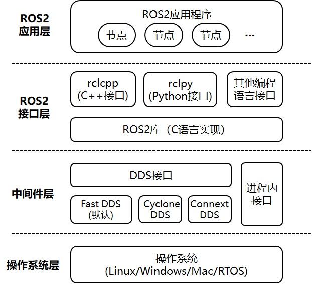
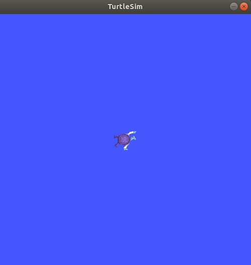
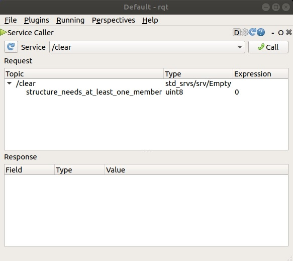
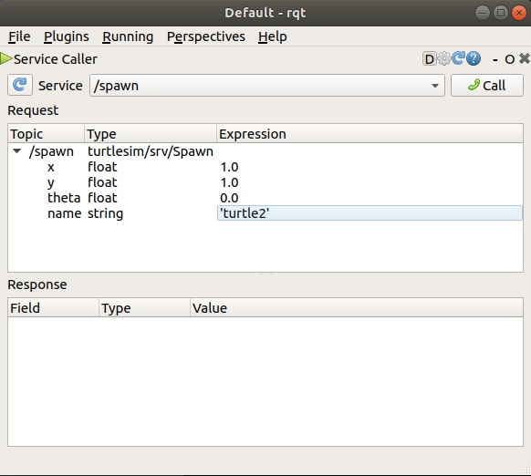
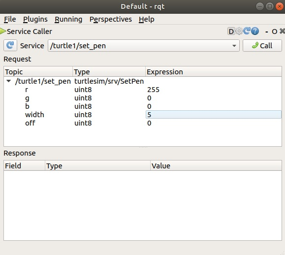
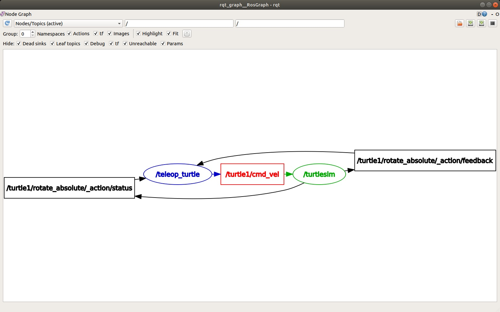
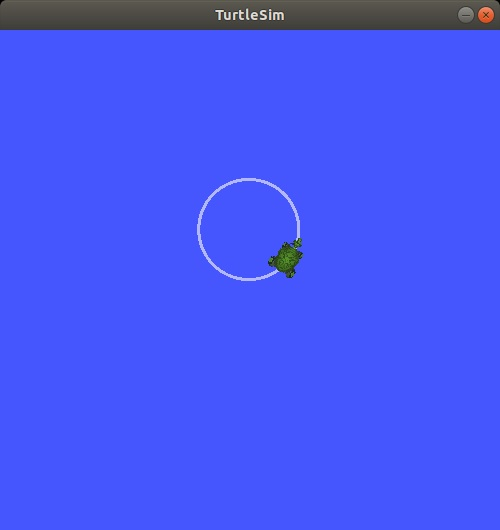

# 4.ROS2安装及功能初探

在众多ROS2版本中，**Humble**是ROS2的一个长期支持版本，支持周期为5年，下面将介绍如何在Ubuntu 22.04操作系统上安装ROS2 Humble。具体安装步骤可参照ROS官方文档：https://docs.ros.org/en/humble/Installation/Ubuntu-Install-Debs.html 。

| 发布时间 | 停止支持 | Ubuntu 版本         | ROS2版本 |
|:--------:|:-------:|:-------------------:|:--------:|
| 2020-06  | 2023-06 | Ubuntu 20.04 Focal  | **Foxy Fitzroy** |
| 2021-05  | 2022-12 | Ubuntu 20.04 Focal  | Galactic Geochelone |
| 2022-05  | 2027-05 | Ubuntu 22.04 Jammy  | **Humble Hawksbill** |
| 2023-05  | 2024-12 | Ubuntu 22.04 Jammy  | Iron Irwini |
| 2024-05  | 2029-05 | Ubuntu 24.04 Noble  | **Jazzy Jalisco** |
| 2025-05  | 2026-12 | Ubuntu 24.04 Noble  | Kilted Kaiju |

## 4.1 安装ROS2 Humble

**（1） 设置语言环境**

ROS2需要支持UTF-8的语言环境，在终端中依次执行以下命令确保系统已正确配置：

```
sudo apt update && sudo apt install -y locales
sudo locale-gen en_US en_US.UTF-8
sudo update-locale LC_ALL=en_US.UTF-8 LANG=en_US.UTF-8
export LANG=en_US.UTF-8
```

安装完成后，执行：

```
locale
```

确保设置成功。

**（2）设置ROS2软件源**

ROS2的部分包位于Ubuntu的Universe仓库中，需要确保该仓库已启用：

```
sudo apt install -y software-properties-common
sudo add-apt-repository universe
```

安装`ros2-apt-source`软件包，用于为系统配置ROS2仓库。当此软件包的新版本发布到ROS2仓库时，仓库配置将自动更新。

```
sudo apt update && sudo apt install curl -y
export ROS_APT_SOURCE_VERSION=$(curl -s https://api.github.com/repos/ros-infrastructure/ros-apt-source/releases/latest | grep -F "tag_name" | awk -F\" '{print $4}')
curl -L -o /tmp/ros2-apt-source.deb "https://github.com/ros-infrastructure/ros-apt-source/releases/download/${ROS_APT_SOURCE_VERSION}/ros2-apt-source_${ROS_APT_SOURCE_VERSION}.$(. /etc/os-release && echo $VERSION_CODENAME)_all.deb" # If using Ubuntu derivates use $UBUNTU_CODENAME
sudo dpkg -i /tmp/ros2-apt-source.deb
```

**（3）安装ROS2 Humble软件包**

添加完软件源后，首先更新Ubuntu系统的软件包索引：

```
sudo apt update
```

由于ROS2软件包是基于Ubuntu系统构建，所以在安装新软件包之前，确保已安装软件更新至最新版本。

```
sudo apt upgrade
```

然后，可以开始安装ROS2 Humble，**推荐方式一：安装桌面版**。桌面版不仅包括ROS基础库，还会同时安装RViz可视化工具、演示示例和教程（安装时需下载约600MB数据，受网速限制耗时约40分钟）。

+ **方式一：安装桌面版（推荐）**，包含了ROS2基础库、RViz可视化工具、演示示例和教程。

```
sudo apt install ros-humble-desktop
```

+ **方式二：只安装ROS2基础库**，仅包括通信库、消息包、命令行工具。

```
sudo apt install ros-humble-ros-base
```

最后，需要安装ROS开发工具`ros-dev-tools`，用于自定义ROS包的开发。

```
sudo apt install ros-dev-tools
```

**（4）安装后环境配置**

安装完成后，为了在终端中能够使用ROS2，需要先执行以下命令，将ROS2导出到环境变量。

```
source /opt/ros/humble/setup.bash
```

每次打开新的终端时，都要先执行上述导出命令，然后才能运行ROS2命令。为了解决这个问题，可以将此命令添加到家目录（~）下的`.bashrc`文件中。由于每次打开新的终端都会自动运行`~/.bashrc`文件中的命令，因此就不用手动执行导出命令了。

可以通过执行以下命令，将`source /opt/ros/humble/setup.bash`添加到`~/.bashrc`文件的最后。

```
echo "source /opt/ros/humble/setup.bash" >> ~/.bashrc
```

或者使用`gedit`编辑器打开`~/.bashrc`文件，将`source /opt/ros/humble/setup.bash`添加到文件最后。

```
gedit ~/.bashrc
```

**（5）验证安装**

为了确认ROS2是否安装成功，可以运行一个简单的示例程序。

打开一个新的终端，运行以下命令启动一个**话题发布者节点**，该节点会发布字符串消息：

```
ros2 run demo_nodes_cpp talker
```

应该会看到类似以下的输出：

```
[INFO] [1652437654.123456] [talker]: Publishing: 'Hello World: 1'
[INFO] [1652437655.123456] [talker]: Publishing: 'Hello World: 2'
```

再打开一个新的终端，运行以下命令启动一个**话题订阅者节点**，该节点会订阅上面发布的消息：

```
ros2 run demo_nodes_py listener
```

应该会看到类似以下的输出：

```
[INFO] [1652437660.123456] [listener]: I heard: 'Hello World: 7'
[INFO] [1652437661.123456] [listener]: I heard: 'Hello World: 8'
```

如果两个终端都能正常工作并看到消息交互，则说明ROS2 Humble安装成功。

**（6）卸载ROS2**

如果需要卸载ROS2，运行以下命令：

```
sudo apt remove ~nros-humble-* && sudo apt autoremove
```

然后删除存储库，并更新软件包索引：

```
sudo apt remove ros2-apt-source
sudo apt update
sudo apt autoremove
sudo apt upgrade
```

**总结**

本节介绍了在Ubuntu 22.04上安装ROS2 Humble的完整步骤，包括语言环境设置、ROS2软件源设置、安装过程、安装后环境配置和安装验证。成功安装ROS2后，就可以开始学习和开发机器人应用程序了。下面将介绍ROS2的核心组件。

## 4.2 ROS2通信架构

ROS2的通信架构是其核心组成部分，负责实现分布式机器人系统中各组件之间的高效数据交换。与ROS1相比，ROS2采用了全新的通信架构设计，基于数据分发服务（DDS，Data Distribution Service）标准，提供了更强大、灵活且可靠的工业级分布式通信能力。

ROS2 通信架构采用分层设计，从上到下主要包含**应用层、接口层、中间件(Middleware)层和操作系统层**：

+ **应用层**：用户开发的节点，每个节点是一个可执行程序，实现特定功能。
+ **接口层**：提供ROS2 API接口，可支持不同的编程语言，如rclcpp库支持C++语言，rclpy库支持Python语言。
+ **中间件层**：统一不同DDS实现的接口，如Fast DDS（默认）、Cyclone DDS、Connext DDS等。
+ **操作系统层**：计算机硬件与软件的接口。

这种分层架构使ROS2能够兼容不同的DDS实现（由不同厂商开发，有开源免费的，也有收费的），同时为用户提供统一的编程接口，隐藏了底层通信的复杂性。采用DDS作为通信中间件，其优点主要表现在：

+ **通信可靠性**：通过DDS提供的多种QoS（服务质量）策略，可以根据不同应用场景配置合适的通信策略；
+ **跨平台支持**：不仅支持Linux系统，还扩展到了Windows、Mac、RTOS等多个操作系统，甚至包括没有操作系统的裸机（如单片机）；
+ **实时性支持**：通过DDS的QoS策略和实时调度支持（需要底层操作系统为实时系统），能够满足工业控制和自动驾驶等对实时性要求极高的应用场景。



## 4.3 功能初探：turtlesim、ros2工具和rqt

`本节内容参照ROS2官方教程（https://docs.ros.org/en/humble/Tutorials/Beginner-CLI-Tools/Introducing-Turtlesim/Introducing-Turtlesim.html）。`

在介绍后续内容前，我们先用一个简单的例子，体验下ROS的基本功能。这里需要用到**turtlesim包**、**ros2工具**和**rqt**。

**（1）预备知识**

**turtlesim**：一款用于学习ROS2的轻量级模拟器，以最基础的形式展示ROS2的核心功能，帮助理解后续在操作真实机器人或机器人仿真系统时将执行的核心任务。

**ROS2工具**：用户管理、查看和交互ROS2系统的核心接口。它支持多种**命令**，可针对系统的不同组件及其运行状态执行操作。例如，开发者可通过它启动节点、设置参数、监听话题等。ROS2工具是ROS2核心安装包的一部分，随核心组件一同安装。

**rqt**：ROS2的图形用户界面（GUI，Graphical User Interface）工具。虽然 rqt 能完成的所有操作都可通过命令行实现，但rqt提供了更友好的交互方式，便于开发者直观地操作ROS2的各类组件。

本节涉及ROS2的核心概念，如节点、话题和服务。这些概念将在后续内容中展开详细讲解；本节的重点是帮助读者完成工具的环境配置，并初步熟悉其使用方式。

**（2）安装turtlesim**

在ROS2中，使用Ubuntu系统APT包管理器安装功能包，命令格式为：

```
sudo apt install ros-<发行版名称>-<功能包名称>
```

例如安装turtlesim（以 Humble 为例）：

```
sudo apt install ros-humble-turtlesim
```

这种方式会自动处理依赖关系，且安装的包位于/opt/ros/<发行版>/目录下，全局可用。

当然，如果安装的是ROS2桌面版（推荐的安装方式），其中包括了turtlesim、rqt等，就不用再重复安装了。

**（3）启动turtlesim**

打开终端，执行以下命令启动turtlesim_node节点：

```
ros2 run turtlesim turtlesim_node
```

执行该命令后，将在终端中看到来自节点的消息输出，包括海龟的名称、海龟的坐标信息。然后会弹出模拟器窗口，窗口中央会显示一只海龟（其颜色为随机生成）。



**（4）使用turtlesim**

打开一个**新终端**，运行一个新节点，用于控制第一个节点中的海龟：

```
ros2 run turtlesim turtle_teleop_key
```

此时，屏幕上应打开了3个窗口：

+ 1个运行turtlesim_node节点的终端
+ 1个运行turtle_teleop_key节点的终端
+ 以及turtlesim模拟器窗口

调整这些窗口的布局，确保既能看到turtlesim模拟器窗口，同时运行turtle_teleop_key的终端处于活动状态（鼠标点一下此窗口，使其在最前端即可），这样可接收键盘输入，以便控制turtlesim中的海龟。

使用键盘上的方向键（↑←↓→）即可控制海龟移动。海龟会在屏幕上四处移动，其附带的"画笔"会绘制出它迄今为止走过的路径。

> 注：按下方向键时，海龟只会移动一小段距离就停止。这样设计的原因在于：在实际应用场景中，例如当操作者与机器人之间的连接中断时，我们不希望机器人继续执行之前的指令，而是及时停止，避免因失去控制导致意外情况发生。

此时，可以通过各类命令的`list子命令`，查看节点及其关联的`话题`、`服务`与`动作`，具体命令如下（`#`后是注释，可以不输入）：

```
ros2 node list     # 查看节点列表
ros2 topic list    # 查看话题列表
ros2 service list  # 查看服务列表
ros2 action list   # 查看动作列表
```

关于这些概念的详细内容，将在后续深入学习。由于本教程的目标仅为对turtlesim有一个整体认知，因此接下来会通过rqt工具调用turtlesim的部分服务，实现与turtlesim_node的交互。

**（5）安装rqt**

打开一个新终端，安装rqt及其插件：

```
sudo apt update
sudo apt install '~nros-humble-rqt*'
```

>注：命令中`'~nros-humble-rqt*'`是通配符写法，用于批量安装所有名称以`ros-humble-rqt`开头的`rqt`相关包（包括核心程序与各类功能插件），确保后续使用时无需额外安装插件。


启动rqt的命令如下：

```
rqt
```

**（6）测试rqt**

首次运行`rqt`时，窗口会处于空白状态，无需担心。只需在顶部菜单栏中依次选择 `Plugins（插件）> Services（服务）> Service Caller（服务调用器） `即可。

> 注：`rqt`加载所有插件可能需要一定时间。如果点击`Plugins（插件）`后，未看到`Services（服务）`或其他选项，应关闭`rqt`，然后在终端中输入命令`rqt --force-discover`，强制重新发现插件。



点击`Service`下拉列表左侧的`刷新`按钮，确保`turtlesim`节点的所有服务都已加载可用。

**（7）spawn服务**

从名称可以推测，`/spawn`服务的功能是在`turtlesim`窗口中创建另一只海龟。按照以下步骤操作，调用`/spawn`服务生成新海龟：

+ **确认服务加载**

确保`rqt`的`Service Caller（服务调用器）`已打开，且通过左侧`刷新`按钮确认`/spawn`服务在列表中可见（若未找到，重新执行`rqt --force-discover`后重试）。

点击`Service`下拉列表，查看 turtlesim 提供的所有服务，然后选择`/spawn`服务。

+ **配置新海龟参数**

在`rqt`的`/spawn`服务参数界面中，填写以下信息：

`name（名称）`：双击`Expression`列对应行的空单引号，输入名称如：turtle2，不可与已存在的名称turtle1重复，否则会报错。

`x/y（坐标）`：在 x 和 y 参数的`Expression`列分别输入有效数值（如 x=1.0、y=1.0，需在turtlesim窗口的坐标系范围内，通常窗口坐标范围为 0~11）。

`theta（朝向）`：可选参数，默认填0.0即可（表示海龟初始朝向沿x轴正方向）。

+ **调用服务**

点击`rqt`窗口右上角的`Call（调用）`按钮，触发`/spawn`服务。

若成功，将看到turtlesim 窗口中会出现一只新的随机样式海龟，位置与输入的x/y坐标一致。若失败，运行turtlesim_node的终端会输出错误信息（如名称重复时会提示 `[ERROR] [turtlesim]: A turtle named [xxx] already exists`），需修正参数后重新调用。

点击`rqt`服务列表的刷新按钮，会发现列表中新增了与新海龟关联的服务（如`/turtle2/set_pen`、`/turtle2/teleport_absolute`等），这些服务可用于单独控制`turtle2`。

在`rqt`中刷新服务列表后，你会发现除了与`turtle1`相关的服务`/turtle1/...`外，还新增了与新海龟相关的服务如`/turtle2/set_pen`、`/turtle2/teleport_absolute`等，这些服务可用于单独控制`turtle2`。



**（8）set_pen服务服务**

下面通过`/set_pen`服务为`turtle1`设置独特的画笔样式。

在`rqt`的`Service Caller`中，刷新服务列表并选择`/turtle1/set_pen`服务。该服务用于配置海龟画笔的颜色、线宽等参数，参数说明如下：

+ `r/g/b`：画笔颜色的RGB值（范围 0~255，例如红色为255,0,0）
+ `width`：线条宽度（整数，例如3表示3像素宽）
+ `off`：画笔开关（0表示启用，1表示禁用，禁用后移动不画线）

例如，若要将`turtle1`的画笔设置为红色（R=255, G=0, B=0）、线宽5像素，可在对应参数的`Expression`列填入数值，然后点击`Call`按钮调用服务。

调用成功后，当通过`turtle_teleop_key`控制`turtle1`移动时，将使用新设置的画笔样式绘制路径。也可以尝试为`turtle2`配置不同的画笔参数，使两只海龟的轨迹呈现明显区别。



**（9）重映射（Remapping）**

你可能已经注意到，目前无法移动`turtle2`，这是因为还没有针对`turtle2`的遥控节点。

要控制`turtle2`，需要启动第2个遥控节点。但如果直接运行之前的命令，会发现这个节点仍然在控制`turtle1`。要改变这种行为，需要对`cmd_vel`话题进行重映射。

打开一个新终端运行：

```
ros2 run turtlesim turtle_teleop_key --ros-args --remap turtle1/cmd_vel:=turtle2/cmd_vel
```

现在，当这个终端处于活跃状态时，你可以控制`turtle2`；而当运行另一个 `turtle_teleop_key`的终端处于活跃状态时，你可以控制`turtle1`。

> 注：重映射（remapping）是 ROS 中一项重要功能，通过--remap参数（简写为-r）可以将一个名称（如话题名、服务名）映射到另一个名称，这里通过将默认控制话题turtle1/cmd_vel重映射为turtle2/cmd_vel，实现了同一个遥控节点对不同海龟的控制。

**（10）停止程序**

若要停止仿真，可在运行`turtlesim_node`的终端中按下`Ctrl + C`组合键（`Ctrl + C`是Linux系统终止进程的通用方式）。

而在运行 `turtle_teleop_key`的终端中，输入`q`即可退出遥操作节点（这是该节点为便捷操作设计的特殊退出方式，当然，也可用`Ctrl + C`停止）。


## 4.4 节点（Nodes）

`本节内容参照ROS2官方教程（https://docs.ros.org/en/humble/Tutorials/Beginner-CLI-Tools/Understanding-ROS2-Nodes/Understanding-ROS2-Nodes.html）。`

`节点（Node）`是 ROS 2 中最基础的元素，在机器人系统中承担单一、模块化的功能。例如，一个节点可能负责控制电机，另一个节点可能负责处理激光雷达数据，还有一个节点可能负责发布图像信息。​

将系统功能拆分为多个节点，有以下优势：​

+ 简化单个组件的开发与维护​
+ 便于独立调试或替换某个功能模块​
+ 支持不同编程语言混合开发（ROS 2 节点可由 C++、Python 等编写）​

一个 ROS 2 可执行文件（如 C++ 程序、Python 脚本）中可以包含一个或多个节点。节点之间通过 ROS 2 的通信机制（话题、服务、动作等）交换数据，共同构成`ROS 2 计算图（ROS 2 graph）`—— 即所有同时运行的节点及其连接关系的网络。


**前提条件：**

+ 已安装 ROS 2（Humble 版本）​
+ 已安装 turtlesim 功能包（可通过 sudo apt install ros-humble-turtlesim 安装）​
+ 已配置好终端的 ROS 2 环境（将source /opt/ros/humble/setup.bash添加到~/.bashrc）

**（1）ros2 run：启动节点**

`ros2 run` 命令用于从指定功能包中启动可执行文件（进而启动节点），语法如下：

```
ros2 run <功能包名称> <可执行文件名称>
```

打开新终端，启动 turtlesim 模拟器：

```
ros2 run turtlesim turtlesim_node
```

此时会弹出 turtlesim 窗口，同时终端会显示模拟器的启动日志（如海龟的初始位置、随机样式等）。​这里，turtlesim 是功能包名称，turtlesim_node 是可执行文件名称。

不过我们还不知道节点的名称（`可执行文件名称`是`文件名`，并不是`节点名`），可通过 `ros2 node list`命令查看节点名称。

**（2）ros2 node list：查看活跃节点**

`ros2 node list`命令用于列出所有正在运行的节点名称，这在多节点系统中追踪节点时非常实用。

保持 turtlesim 窗口和终端运行，再打开一个新终端，运行：

```
ros2 node list
```

终端会输出当前唯一的活跃节点名称：

```
/turtlesim
```

再打开一个新终端，启动遥操作节点（用于控制海龟移动）：

```
ros2 run turtlesim turtle_teleop_key
```

终端会显示操作提示（如`使用方向键控制海龟，按 q 退出`）。

回到运行`ros2 node list`的终端，再次执行该命令，此时会看到两个活跃节点：

```
/turtlesim
/teleop_turtle
```

**（3）重映射（Remapping）：自定义节点属性**

**重映射**是 ROS 2 的核心功能之一，允许在不修改源代码的情况下，将节点的默认属性（如节点名称、话题名称、服务名称等）重新分配为自定义值。​

例如，我们可以为新启动的 turtlesim_node 重新命名，而非使用默认的 /turtlesim：

```
ros2 run turtlesim turtlesim_node --ros-args --remap __node:=my_turtle
```

这里：​
+ `--ros-args`：表示后续参数是 ROS 2 节点的配置参数​
+ `--remap __node:=my_turtle`：将节点的默认名称（`__node`是 ROS 2 特殊参数）重映射为 my_turtle

再次运行`ros2 node list`，会看到三个活跃节点：

```
/my_turtle
/turtlesim
/teleop_turtle
```

此时屏幕上会有两个 turtlesim 窗口，分别对应 /turtlesim 和 /my_turtle 节点。

**（4）ros2 node info：查看节点详情**

`ros2 node info <节点名称>`命令用于查看单个节点的详细信息，包括其订阅的话题、发布的话题、提供的服务、支持的动作等 —— 即该节点在ROS2计算图中的所有连接关系。​
查看 my_turtle 节点的信息，运行：

```
ros2 node info /my_turtle
```

终端会输出该节点的：`Subscribers订阅话题`、`Publishers发布话题`、`Service服务`、`Action动作`），即该节点在ROS2计算图（Graph）中的所有连接关系。

```
/my_turtle
  Subscribers:
    /parameter_events: rcl_interfaces/msg/ParameterEvent
    /turtle1/cmd_vel: geometry_msgs/msg/Twist
  Publishers:
    /parameter_events: rcl_interfaces/msg/ParameterEvent
    /rosout: rcl_interfaces/msg/Log
    /turtle1/color_sensor: turtlesim/msg/Color
    /turtle1/pose: turtlesim/msg/Pose
  Service Servers:
    /clear: std_srvs/srv/Empty
    /kill: turtlesim/srv/Kill
    /my_turtle/describe_parameters: rcl_interfaces/srv/DescribeParameters
    /my_turtle/get_parameter_types: rcl_interfaces/srv/GetParameterTypes
    /my_turtle/get_parameters: rcl_interfaces/srv/GetParameters
    /my_turtle/list_parameters: rcl_interfaces/srv/ListParameters
    /my_turtle/set_parameters: rcl_interfaces/srv/SetParameters
    /my_turtle/set_parameters_atomically: rcl_interfaces/srv/SetParametersAtomically
    /reset: std_srvs/srv/Empty
    /spawn: turtlesim/srv/Spawn
    /turtle1/set_pen: turtlesim/srv/SetPen
    /turtle1/teleport_absolute: turtlesim/srv/TeleportAbsolute
    /turtle1/teleport_relative: turtlesim/srv/TeleportRelative
  Service Clients:

  Action Servers:
    /turtle1/rotate_absolute: turtlesim/action/RotateAbsolute
  Action Clients:
```

尝试查看 /teleop_turtle 节点的信息：​

```
ros2 node info /teleop_turtle
```

对比输出结果会发现，/teleop_turtle 作为遥操作节点，仅发布控制指令（/turtle1/cmd_vel），没有提供服务或动作服务器，这与其`控制者`的功能定位一致。

**（5）停止节点**

+ 对于 turtlesim_node 这类常规节点：在运行节点的终端中按下`Ctrl + C`即可终止，这是Linux系统终止进程的一般方式。
​
+ 对于 turtle_teleop_key 节点：除了`Ctrl + C`，还可以在终端中输入`q`退出（该节点的特殊设计，在源代码中实现）。


**总结**

本节介绍了 ROS 2 节点的核心概念及三个关键命令：

|命令 |功能|
|:----:|:----:|
|ros2 run <功能包名称> <可执行文件名称> | 从功能包启动可执行文件（节点）|
|ros2 node list | 列出所有活跃节点的名称|
|ros2 node info <节点名称> | 查看单个节点的通信连接详情|

节点是构成 ROS 2 系统的`积木`，而连接这些积木的`桥梁`就是接下来要介绍的另一重要概念—`话题（Topics）`。

## 4.5 话题（Topics）

`话题（Topics）`是 ROS 2 中节点间最常用的异步通信方式，适用于持续的数据传输场景（如传感器数据发布、机器人状态更新等）。

节点通过`发布-订阅（Publish-Subscribe）`模式在话题上通信：

+ 发布者（Publisher）：向特定话题发送数据的节点（如激光雷达节点发布环境扫描数据）
+ 订阅者（Subscriber）：接收特定话题数据的节点（如避障节点订阅激光雷达数据）

+ 消息（Message）：话题上传输的数据格式，需提前定义（如 geometry_msgs/msg/Twist 用于运动控制指令）

一个话题可对应多个发布者和订阅者，节点无需知晓彼此的存在，只需通过统一话题交换数据，这种松耦合特性让系统更易扩展。


**（1）启动节点与话题准备**

打开新终端，启动 turtlesim 节点：

```
ros2 run turtlesim turtlesim_node
```


再打开一个新终端，启动遥操作节点（用于控制海龟移动）：

```
ros2 run turtlesim turtle_teleop_key
```

此时，turtle_teleop_key 节点会向 /turtle1/cmd_vel 话题发布运动指令，turtlesim_node 节点订阅该话题以控制海龟移动。

**（2）rqt_graph**

rqt_graph 是一款图形化内省（Introspection）工具。可以通过 rqt_graph 直观展示节点、话题及其连接关系的动态变化，这对理解 ROS 计算图的结构至关重要。

rqt_graph 是 rqt 工具集的一部分，可通过以下方式启动：

```
ros2 run rqt_graph rqt_graph
```

也可以通过另一种方式打开 rqt_graph：先运行 rqt 打开主窗口，然后选择Plugins > Introspection > Node Graph。



在左上角下拉列表选择`Nodes/Topics(active)`，可以看到上述节点和话题，以及图边缘的两个动作（目前先忽略）。如果将鼠标悬停在中间的话题上，会看到如上图所示的颜色高亮效果。

这张图展示了 /turtlesim 节点与 /teleop_turtle 节点如何通过话题进行通信：/teleop_turtle 节点会将数据（你输入的用于控制海龟移动的按键指令）发布到 /turtle1/cmd_vel 话题，而 /turtlesim 节点则订阅该话题以接收这些数据。

在分析包含大量节点和话题、且连接关系复杂的系统时，rqt_graph 的高亮功能非常实用。

**（3）ros2 topic list：查看活跃话题**

`ros2 topic list`命令用于列出所有正在传输数据的话题，可通过参数扩展功能。

+ 基础用法：直接查看话题名称​。

```
ros2 topic list
```

输出（含 turtlesim 相关核心话题）：

```
/parameter_events
/rosout
/turtle1/cmd_vel
/turtle1/color_sensor
/turtle1/pose
```

+ 查看话题数据类型：添加`-t`（type）参数

```
ros2 topic list -t
```

输出（格式为`话题名称：消息类型`）：

```
/parameter_events [rcl_interfaces/msg/ParameterEvent]
/rosout [rcl_interfaces/msg/Log]
/turtle1/cmd_vel [geometry_msgs/msg/Twist]
/turtle1/color_sensor [turtlesim/msg/Color]
/turtle1/pose [turtlesim/msg/Pose]
```

这些属性（尤其是**消息类型**）是节点在通过话题传输数据时，确认彼此传递的是同类信息的依据。

如果想知道这些话题在 rqt_graph 中具体位置，可以取消勾选 "Hide"（隐藏）右侧的所有复选框。

**（4）ros2 topic echo：查看话题数据​**

`ros2 topic echo <话题名称>`命令用于实时打印话题上传输的消息数据，可直观观察节点通信内容。​

查看 /turtle1/cmd_vel 话题的运动指令数据：​

```​
ros2 topic echo /turtle1/cmd_vel
```

启动后，这个命令不会返回任何数据，这是因为它在等待 /teleop_turtle 节点发布信息。回到 turtle_teleop_key 节点的终端，按方向键控制海龟移动，此时上述终端会实时输出：

```
linear:
  x: 2.0​
  y: 0.0
  z: 0.0​
angular:​
  x: 0.0​
  y: 0.0​
  z: 0.0​
---
```

其中，`linear.x` 表示前进速度，`angular.z` 表示旋转速度，`---` 分隔不同消息帧。

**（5）ros2 topic info：查看话题详情​**

`ros2 topic info <话题名称>`命令用于查看话题的发布者、订阅者数量及消息类型。

> 话题并非只能用于一对一通信，它们支持一对多、多对一或多对多的通信模式，因此一个话题可能有多个发布者、多个订阅者。

查看 /turtle1/cmd_vel 话题信息:

```
ros2 topic info /turtle1/cmd_vel
```

输出：

```
Type: geometry_msgs/msg/Twist
Publishers: 1
Subscribers: 1
```

可见该话题消息类型为 geometry_msgs/msg/Twist，有1个发布者、1个订阅者。

**（6）ros2 interface show：查看消息类型结构​**

节点通过`消息`（Messages） 在话题上传输数据。发布者与订阅者必须发送和接收同一种类型的消息，才能实现通信。

之前运行 `ros2 topic list -t` 命令后看到的 `话题类型`，其实就是每个话题所使用的消息类型。回想一下，cmd_vel 话题的类型是：

```
geometry_msgs/msg/Twist
```

这意味着在 geometry_msgs 功能包中，存在一个名为 Twist 的消息（msg）。

现在我们可以对这个消息类型运行 `ros2 interface show <消息类型>` 命令，来了解其详细信息，特别是该消息所要求的数据结构。


查看 geometry_msgs/msg/Twist 消息结构：

```
ros2 interface show geometry_msgs/msg/Twist
```

输出：

```
# This expresses velocity in free space broken into its linear and angular parts.
    Vector3  linear
            float64 x
            float64 y
            float64 z
    Vector3  angular
            float64 x
            float64 y
            float64 z
```

这表明 /turtlesim 节点期望接收的消息包含两个向量：linear（线速度）和 angular（角速度），每个向量各有3个元素。回想一下通过 echo 命令看到的 /teleop_turtle 传递给 /turtlesim 的数据，会发现它们的结构完全一致：

```
linear:
  x: 2.0
  y: 0.0
  z: 0.0
angular:
  x: 0.0
  y: 0.0
  z: 0.0
---
```

**（7）ros2 topic pub：手动发布话题消息​**

ros2 topic pub 命令用于手动向话题发布消息，可用于测试订阅者节点的响应。语法如下:

```
ros2 topic pub <话题名称> <消息类型> '<消息数据>'
```

+ 添加 `-1` 参数：仅发布一次消息
+ 添加 `-r <频率>`参数：按指定频率（Hz）持续发布消息

海龟（通常真实机器人也是如此）需要持续的指令流才能才能持续运行。因此，要让海龟移动并保持移动状态，可以使用以下命令。需要特别注意的是，该命令中的参数需要采用 YAML 语法输入。完整命令如下：

```
ros2 topic pub /turtle1/cmd_vel geometry_msgs/msg/Twist "{linear: {x: 2.0, y: 0.0, z: 0.0}, angular: {x: 0.0, y: 0.0, z: 1.8}}"
```

如果不使用任何命令行选项，ros2 topic pub 会以 1 Hz 的频率持续发布命令。



要实现只发布一次命令，可添加 `-1` 选项。

```
ros2 topic pub -1 /turtle1/cmd_vel geometry_msgs/msg/Twist "{linear: {x: 2.0, y: 0.0, z: 0.0}, angular: {x: 0.0, y: 0.0, z: 1.8}}"
```

此时，海龟运动一小段距离后会停止。

**（8）ros2 topic hz：查看话题发布频率​**

`ros2 topic hz <话题名称>` 命令用于统计话题的消息发布频率（Hz），反映数据更新速度。

查看 /turtle1/pose 话题（海龟位置信息）的发布频率：

```
ros2 topic hz /turtle1/pose
```

输出（约50Hz，即每秒发布50次位置数据）:

```
average rate: 50.556
	min: 0.000s max: 0.088s std dev: 0.01547s window: 156
```

**（9）ros2 topic bw：查看话题带宽​**

可以使用以下命令查看话题所占用的带宽：

```
ros2 topic bw /turtle1/pose
```

输出：

```
Subscribed to [/turtle1/pose]
1.33 KB/s from 100 messages
    Message size mean: 0.02 KB min: 0.02 KB max: 0.02 KB
```

**（10）清理**

到此，应该已经运行了多个节点。别忘了在每个运行节点的终端中按下 Ctrl+C 来停止它们。对于 turtlesim 这类图形化节点，直接关闭窗口也可终止运行，但通过 Ctrl+C 退出能确保资源释放更彻底。

**总结**

本节介绍了 ROS 2 话题的核心概念及常用命令：

|命令|功能|
|:---:|:---:|
|rqt_graph|图形化方式查看计算图|
|ros2 topic list [-t]​|列出活跃话题（-t 显示消息类型）​|
|ros2 topic echo <话题名称>​|实时打印话题消息数据​|
|ros2 topic info <话题名称>​|查看话题的发布者、订阅者及消息类型​|
|ros2 interface show <消息类型>​|查看消息类型的字段结构​|
|ros2 topic pub [-1/-r <频率>] <话题> <消息类型> '<消息数据>'​|手动发布话题消息（-1 单次，-r <频率>持续）​|
|ros2 topic hz <话题名称>​|统计话题消息发布频率|
|ros2 topic bw <话题名称>​|统计话题消息发布带宽​|

**话题**作为 ROS 2 异步通信的核心，适用于传感器数据流、状态监控等持续传输场景。

对于ROS2的其他通信方式：

+ **服务**（Services）：一种同步通信方式，基于**请求-响应**(Request-Response）模式工作。
+ **动作**（Actions）：一种异步通信方式，基于**目标-反馈-结果**（Goal-Feedback-Result）模式工作。

我们将在以后介绍。
