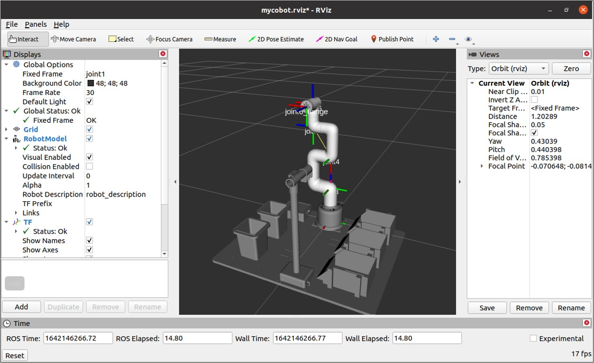

# 9. 工具集

在ROS2开发过程中，除了核心的通信机制（话题、服务等）和启动工具，还有一系列辅助工具能显著提升开发效率。例如：数据记录与回放、可视化调试、仿真测试等，是机器人开发流程中不可或缺的组成部分。

## 9.1 数据记录与回放：ros2 bag

在机器人调试中，经常需要复现特定场景，如：

+ 算法测试：记录真实激光雷达数据，回放时测试建图或避障算法，无需反复移动机器人；
+ 教学演示：记录一次完整的机器人导航过程，回放时讲解关键节点的工作原理；
+ 故障分析：记录机器人失控前的传感器数据和控制指令，离线排查是否因传感器噪声或指令异常导致故障。

**ros2 bag**是 ROS2提供的数据记录与回放工具，能够将话题上传输的数据保存到文件中，后续可通过回放文件重现当时的数据流，便于离线分析和算法调试。

### 9.1.1 记录话题数据

首先启动一个可产生话题数据的节点（以turtlesim为例）：

```
# 终端1：启动turtlesim
ros2 run turtlesim turtlesim_node
# 终端2：启动键盘控制（产生/turtle1/cmd_vel话题）
ros2 run turtlesim turtle_teleop_key
```

在新终端中，使用ros2 bag record命令记录话题：

```
# 记录所有话题
ros2 bag record -a

# 记录单个话题（如/turtle1/cmd_vel）
ros2 bag record /turtle1/cmd_vel

# 记录多个话题（如同时记录速度指令和海龟位置）
ros2 bag record /turtle1/cmd_vel /turtle1/pose

# 记录所有活跃话题（谨慎使用，可能产生大量数据）
ros2 bag record /turtle1/cmd_vel /turtle1/pose

# 自定义保存路径和文件名（-o 输出前缀）
ros2 bag record -o turtle_move /turtle1/cmd_vel /turtle1/pose
```

执行后，工具会创建一个以时间戳命名的文件夹（或指定前缀 + 时间戳），内含.db3格式的数据文件（默认使用 SQLite 存储）。记录过程中，用键盘遥控海龟运动，终端会显示实时记录的话题和数据量。按Ctrl+C停止记录。

### 9.1.2 查看记录文件信息

使用`ros2 bag info`命令查看记录文件的详细信息：

```
# 格式：ros2 bag info <记录文件夹名>
ros2 bag info turtle_move_2025_10_01-15_30_45
```

输出内容包括：

+ 文件名、记录时间、持续时长；
+ 包含的话题列表（名称、消息类型、数据量、频率）；
+ 存储格式、文件大小等。

### 9.1.3 回放记录的数据

回放数据前，确保原节点已停止（避免数据冲突），然后使用`ros2 bag play`命令：

```
# 格式：ros2 bag play <记录文件夹名>
ros2 bag play turtle_move_2025_10_01-15_30_45
```

回放时，工具会按照记录时的时间顺序发布话题数据。此时启动turtlesim节点，会看到海龟按照记录的轨迹运动，重现之前的控制过程：

```
# 新终端启动turtlesim，会按照回放的/cmd_vel指令运动
ros2 run turtlesim turtlesim_node
```

使用`ros2 bag play`命令时，有时会加入以下参数：

+ **-l**：循环回放（适合反复测试同一场景）；
    + `ros2 bag play –l turtle_move_2025_10_01-15_30_45`

+ **--rate <倍数>**：调整回放速度（如--rate 2表示2倍速）。
    + `ros2 bag play –-rate 2 turtle_move_2025_10_01-15_30_45`

## 9.2 可视化调试工具：RViz2

RViz2是 ROS2 中最常用的三维可视化工具，用于直观展示机器人的传感器数据、坐标系关系、路径规划结果等。它支持多种数据类型的可视化（如点云、激光扫描、图像、机器人模型），是调试机器人系统的 "眼睛"。



### 9.2.1 RViz2 的核心功能

+ 实时显示传感器数据（激光雷达扫描结果、摄像头图像、IMU 数据等）；
+ 可视化机器人模型（URDF/Xacro 格式）及关节状态；
+ 显示坐标系（TF 变换），直观查看机器人各部件的位置关系；
+ 绘制路径、目标点、障碍物等规划相关数据；
+ 保存和加载可视化配置，便于复现调试场景。

### 9.2.2 基本使用方法

**（1）启动 RViz2**

```
rviz2
```

首次启动时，会显示一个空白窗口，包含菜单栏、工具栏、显示面板（左侧）、3D 视图（中央）和状态栏。

**（2）添加可视化组件**

+ 启动机器人相关节点（提供可可视化的话题）：

+ 在RViz2中添加话题的可视化：
    + 点击左侧Displays面板下方的Add按钮；
    + 在弹出的对话框中，选择 "By topic" 标签；
    + 找到对应的话题，点击OK添加；
    + 此时3D视图中会显示话题数据。

**（3）保存与加载配置**

当配置好需要的可视化组件后，可保存配置文件以便下次使用：

+ 菜单栏选择File → Save Config As，保存为*.rviz文件（如 demo.rviz）；
+ 下次启动时，通过File → Open Config加载该文件，自动恢复之前的可视化设置。

**（4）常用可视化类型**

+ **LaserScan**：显示激光雷达的扫描数据（点云或线段）；
+ **Image**：显示摄像头图像；
+ **Odometry**：显示里程计数据（轨迹、速度矢量）；
+ **Marker**：显示自定义标记（如目标点、障碍物框）；
+ **RobotModel**：显示机器人的 3D 模型（需加载 URDF 文件）。

### 9.2.3 实用技巧

+ **视角控制**：在 3D 视图中，鼠标拖动可旋转视角，滚轮缩放，Shift + 拖动平移；
+ **话题过滤**：在 "Displays" 面板中，可暂时关闭某个组件的显示（取消勾选）；
+ **坐标变换**：在工具栏 "Fixed Frame" 下拉框中选择参考坐标系（如以机器人基坐标系为+ 原点）；
+ **测量工具**：工具栏的 "Measure" 按钮可测量 3D 视图中两点的距离。

## 9.3 仿真工具

在实际硬件准备就绪前，仿真工具是测试机器人算法的重要手段。ROS2 支持多种仿真环境，它们能模拟物理世界的机器人运动、传感器数据和环境交互，降低开发成本并提高安全性。常用仿真工具有：

+ **Gazebo**
    最主流的 ROS2 仿真工具，支持复杂物理引擎（如 ODE、Bullet），可模拟机器人运动、碰撞检测、光照等。适合测试导航、抓取等需要物理交互的场景。
    + 特点：开源、功能全面，支持多机器人仿真；
    + 启动方式：gazebo（纯仿真环境）或ros2 launch gazebo_ros empty_world.launch.py（ROS2 集成版）。

+ **TurtleSim**
    随 ROS2 默认安装的简易仿真器（我们已多次使用），适合入门级演示和基础算法测试（如运动控制、坐标变换）。
    + 特点：轻量、启动快，无复杂物理模拟；
    + 启动方式：ros2 run turtlesim turtlesim_node。

+ **Webots**
    跨平台仿真工具，支持高精度传感器（如激光雷达、摄像头、IMU）和机器人模型，自带丰富的场景库（家庭、工厂、户外等）。
    + 特点：图形界面友好，适合教育和快速原型开发；
    + 与ROS2集成：通过webots_ros2包实现数据交互。

+ **Ignition Gazebo**
    Gazebo 的升级版，采用更现代的架构，支持更高效的物理模拟和 3D 渲染，是 ROS2 未来主推的仿真环境之一。
    + 特点：性能更优，支持分布式仿真；
    + 启动方式：ign gazebo（基础环境）或通过 ROS2 Launch 文件启动集成场景。
