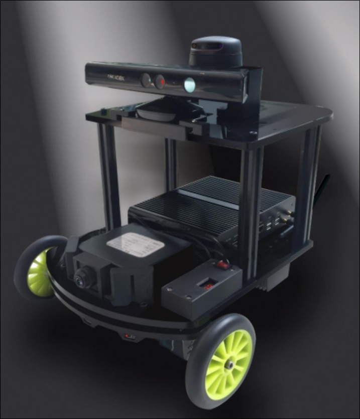
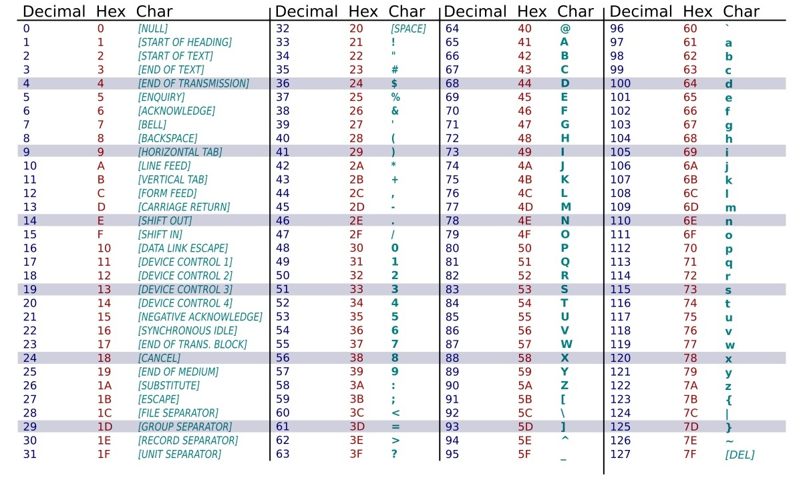
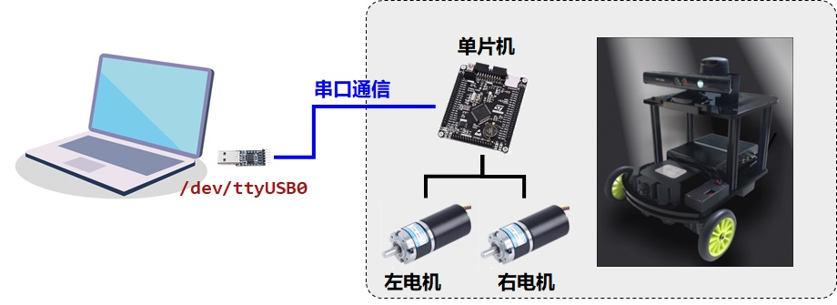
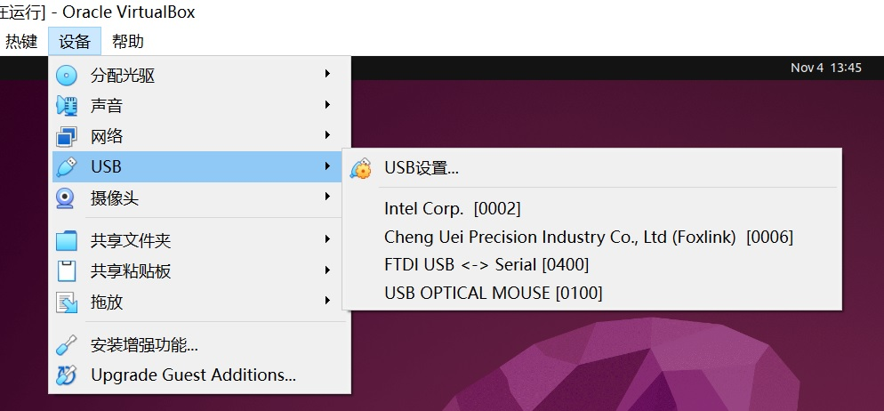

# 11.机器人控制

机器人感知让我们**看见**世界，而机器人控制让机器**行动**起来。

控制层是机器人系统的执行核心——它接收来自上层（如导航、决策）的运动指令，通过通信接口（如串口、CAN 总线、Ethernet）传递到底层驱动板，从而实现轮式底盘、机械臂、电机等的物理动作。

本章将以一个差速驱动底盘为例，介绍 ROS2 系统中控制相关的消息类型、串口通信方法，以及如何在 ROS2 节点中实现"`订阅速度话题` → `生成串口控制命令` → `下发给底盘`"的完整控制流程。

通过本章学习，你将能够：

+ 理解 ROS2 中控制相关的标准消息类型；
+ 掌握 Python 中串口通信的基本方法；
+ 在虚拟机环境下模拟并调试串口通信；
+ 设计并实现一个 cmd_vel 到底盘串口指令的转换节点；

## 11.1 ROS2 中的控制消息类型

在 ROS2 中，机器人运动控制最常用的消息类型有：

+ `geometry_msgs/msg/Twist`：表示线速度与角速度，是移动机器人控制的核心；
+ `sensor_msgs/msg/JointState`：表示机械臂或关节角度信息；
+ `trajectory_msgs/msg/JointTrajectory`：用于轨迹控制；
+ `std_msgs/msg/Float64` 或 `Float64MultiArray`：用于简单的数值控制场景。

对于移动机器人运动速度控制，ROS社区定义了统一的控制接口 ——
`cmd_vel`话题（Command Velocity）。

`cmd_vel` 消息类型为 `geometry_msgs/msg/Twist`，包含两个三维向量：

```python
geometry_msgs/msg/Twist:
    linear:
        x, y, z     # 线速度 (m/s)
    angular:
        x, y, z     # 角速度 (rad/s)
```

对于地面差速移动机器人而言，只需关注：

```
linear.x：前进/后退速度；
angular.z：旋转角速度。
```

上层控制（如键盘、导航算法）发布 `cmd_vel`，底层节点接收并将其转换为对应的电机控制指令。

## 11.2 串口通信基础

### (1)串口通信简介

串口（Serial Port）是一种常见的低速、可靠的点对点通信方式。
机器人控制系统中，主控计算机（上位机）常通过 USB 转串口模块与底层控制板（如 STM32）通信。

### (2)串口参数说明

在此，以**xq4-pro**移动机器人为例，其中的机器人电机控制协议采用串口通信方式，其官方文档详见 https://doc.bwbot.org/zh-cn/books-online/xq-manual/topic/19.html 。



此移动机器人为`差速驱动`，有2个驱动轮、1个从动轮（全向轮，提供支撑），可实现机器人的前进、后退、左转、右转。

**xq4-pro**移动机器人底盘控制协议的串口参数如下：

|波特率|数据位|停止位|校验位|流控|
|:--:|:--:|:--:|:--:|:--:|
|115200|8|1|无|无|

通信采用**ASCII码**或**十六进制**协议帧格式，由上位机发送命令帧、底层返回数据帧。

> ASCII码：ASCII码是美国信息交换标准代码（American Standard Code for Information Interchange），是一个基于拉丁字母的字符编码系统，用7位二进制数表示128个字符。包括33个控制字符和95个可显示字符（字母、数字、标点符号等），是早期计算机和通信设备数据交换的通用标准。 



### (3)USB转串口



如何在虚拟机中使用USB转串口？

+ ① 将USB转串口设备插入计算机的USB口
+ ② 虚拟机菜单：设备→USB→选择对应的USB设备（如`FTDI USB <-> Serial`）
+ ③ 在虚拟机Linux操作系统的`/dev`路径下会出现该设备，如`/dev/ttyUSB0`
+ ④ 可使用 `$ ls /dev` 命令查看



## 11.3 串口通信协议详解

**xq4-pro**移动机器人串口通信的每个数据帧由3部分组成，即`帧头` + `长度` + `内容`部分：

|帧头(3字节) |长度(字节) |内容(n字节) |
|:--:|:--:|:--:|
|固定帧头| 内容的字节数| 实际控制内容 |
|如：`0xCD 0xEB 0xD7`| 如：`0x02` | 命令+参数 |

其中的内容中的命令分为**单字节命令**、**双字符命令**和**多字符命令**。

### (1)单字符命令

|命令|	含义|
|--|--|
|`'T' (0x54)`|	调试模式|
|`'R' (0x52)`|	运行模式|
|`'I' (0x49)`|	软件复位|

例如**软件复位命令**：`0xCD 0xEB 0xD7` `0x01` `0x49`

### (2)双字符命令

命令形式：`命令字符 + 参数`

|命令|	功能|	参数范围|
|--|--|--|
|`'f' (0x66)`|	前进|	`0~100`|
|`'b' (0x62)`|	后退|	`0~100`|
|`'s' (0x73)`|	刹车|	`任意`|
|`'c' (0x63)`|	左转|	`0~100`|
|`'d' (0x64)`|	右转|	`0~100`|

例如:

+ 以80% (`80 = 0x50`) 刹车量刹车：
    + `0xCD 0xEB 0xD7` `0x02` `0x73 0x50`

+ 以16% (`16 = 0x10`) 左转：
    + `0xCD 0xEB 0xD7` `0x02` `0x63 0x10`

### (3)多字符命令

完整格式：`tXXXXxxxx`（共9字符）

|`t(0x74)` | `XXXX` | `xxxx` |
|:---:|:---:|:---:|
|电机设置标识<br>`0x74`|电机状态<br>`F(0x46)`-前进<br> `B(0x42)`-后退<br> `S(0x53)`-刹车|电机速度<br>（`0~100`）|

因此可见，此协议可同时控制4个电机，其中`t`是电机设置标识，`XXXX`为4个电机的状态，`xxxx`为4个电机的速度。

但xq4-pro移动机器人只有两个电机，因此仅前两个电机有效，右轮为电机1，左轮为电机2。

+ **例：让4个电机全部刹车**：

```
tSSSS0000
```

对应帧：

`0xCD 0xEB 0xD7` `0x09` `0x74` `0x53 0x53 0x53 0x53` `0x00 0x00 0x00 0x00`

+ **例：让右电机以0x30速度前进、左电机以0x30速度后退（此时机器人会原地旋转）**：

对应帧：

`0xCD 0xEB 0xD7` `0x09` `0x74` `0x46 0x42 0x53 0x53` `0x30 0x30 0x00 0x00`

## 11.4 虚拟串口工具

在与机器人硬件通信前，可使用`虚拟`串口工具`socat`创建虚拟串口对，用于模拟程序与机器人控制器通信。

首先，安装虚拟串口工具`socat`:

`sudo apt install socat`

然后，启动虚拟串口工具：

`socat -d -d pty,raw,echo=0 pty,raw,echo=0`

输出类似：

```
PTY is /dev/pts/0
PTY is /dev/pts/2
```

表明共虚拟了两个串口对，可任选一个如`/dev/pts/0`作为程序端口，`/dev/pts/2`模拟机器人控制器。

打开一个新的终端，执行以下命令，开始监听串口数据，模拟机器人控制器。

`xxd /dev/pts/2`

只要有程序向`/dev/pts/0`发送数据，此处的`/dev/pts/2`都会收到并打印出来。

## 11.5 Python 串口通信实现

Python 中可使用 `pyserial` 库实现串口收发。

若未安装 `pyserial` 库，需通过`pip3`安装：

```
sudo apt install python3-pip  #若未安装pip3，需先安装pip3
pip3 install pyserial         #再用pip3安装pyserial
```

新建`control.py`文件，填入以下内容：

```python
import serial
import time

ser = serial.Serial('/dev/pts/0', 115200, timeout=0.5)

def send_frame(data_bytes):
    ser.write(bytes(data_bytes))
    print("Sent:", [hex(b) for b in data_bytes])

# 发送前进命令(以50%速度, 50 = 0x32)
frame = [0xCD, 0xEB, 0xD7, 0x02, 0x66, 0x32]
send_frame(frame)

# 等待3秒
time.sleep(3)

# 发送停止命令
frame = [0xCD, 0xEB, 0xD7, 0x02, 0x73, 0x50]
send_frame(frame)
```

运行此python脚本文件：

`python3 control.py`

可以在刚才运行`xxd /dev/pts/2`的终端，接收到发送的串口命令。

## 11.6 根据`cmd_vel`消息控制底盘

我们现在将 ROS2 控制消息与底层串口控制结合起来。

新建ROS2包`control_demo`，并新建节点`robot_control.py`：

```
cd ~/ros2_ws/src
ros2 pkg create --build-type ament_python control_demo
```

在 `control_demo/control_demo` 下创建节点文件`robot_control.py`：

```
cd control_demo/control_demo
gedit robot_control.py
```

填入以下代码：

```python
#!/usr/bin/env python3
import rclpy
from rclpy.node import Node
from geometry_msgs.msg import Twist
import serial

class RobotControl(Node):
    def __init__(self):
        super().__init__('robot_control')
        self.subscription = self.create_subscription(
            Twist, 'cmd_vel', self.cmd_callback, 10)
        
        self.ser = serial.Serial('/dev/pts/0', 115200, timeout=0.5)
        self.get_logger().info("Robot Control Node Started")

    def send_frame(self, data_bytes):
        self.ser.write(bytes(data_bytes))
        self.get_logger().info(f"Sent: {[hex(b) for b in data_bytes]}")

    def cmd_callback(self, msg: Twist):
        linear  = msg.linear.x
        angular = msg.angular.z
        if abs(linear) < 0.05 and abs(angular) < 0.05: # 停止
            cmd = [0x74, 0x53, 0x53, 0x53, 0x53, 0, 0, 0, 0]
        else:
            # 差速控制
            right = linear + angular # 右电机 = linear + angular
            left  = linear - angular # 左电机 = linear - angular
            # 限幅 -1~1
            right = max(min(right, 1.0), -1.0)
            left  = max(min(left, 1.0), -1.0)
            # 电机方向
            right_dir = 0x46 if right >= 0 else 0x42
            left_dir  = 0x46 if left  >= 0 else 0x42
            # 电机速度（0~100）
            right_speed = int(abs(right) * 100)
            left_speed  = int(abs(left) * 100)
            # 构造 tXXXXxxxx
            # motor1=右轮 motor2=左轮 motor3/4 无效
            cmd = [0x74, right_dir, left_dir, 0x53, 0x53, right_speed, left_speed, 0, 0]
        # 组帧
        frame = [0xCD, 0xEB, 0xD7, len(cmd)] + cmd
        self.send_frame(frame)


def main(args=None):
    rclpy.init(args=args)
    node = RobotControl()
    rclpy.spin(node)
    node.destroy_node()
    rclpy.shutdown()

if __name__ == '__main__':
    main()
```

可以先不用配置`setup.py`文件，而是用python3命令启动此节点：

`python3 robot_control.py`

此时，节点运行，会实时监听`cmd_vel`话题内容，并转为控制指令发送到串口。

## 11.7 向`cmd_vel`发送消息

运行节点后，如何在不编写代码的情况下向`cmd_vel`话题发送速度命令呢？

+ 方式一：通过`ros2 topic pub`命令

```
# 前进
ros2 topic pub /cmd_vel geometry_msgs/msg/Twist "{linear: {x: 0.5,y: 0.0,z: 0.0}, angular: {x: 0.0,y: 0.0,z: 0.0}}"
# 旋转
ros2 topic pub /cmd_vel geometry_msgs/msg/Twist "{linear: {x: 0.0,y: 0.0,z: 0.0}, angular: {x: 0.0,y: 0.0,z: 0.5}}"
```

+ 方式二：通过`teleop_twist_keyboard`节点

在安装ROS2时，自动安装了`teleop_twist_keyboard`功能包，其中的`teleop_twist_keyboard`节点可根据键盘按键，向`cmd_vel`话题发送速度命令。使用`ros2 run`命令启动：

```
ros2 run teleop_twist_keyboard teleop_twist_keyboard
```

即可通过键盘控制底盘运动：

```
Moving around:
   u    i    o
   j    k    l
   m    ,    .
```

+ `i` `,` `j` `l`分别为`前进` `后退` `左转` `右转`
+ `k`为`停止`
+ `u` `o` `m` `,`分别为`左前` `右前` `左后` `右后`

## 总结

本章介绍了串口通信机制、xq4-pro移动机器人底盘控制协议，并通过一个 `cmd_vel` 到串口控制的示例程序，完成了从控制命令产生到发送给驱动器的全过程。
