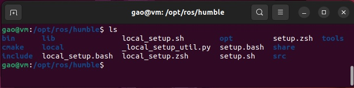

# 5.发布者与订阅者

前面我们以turtlesim为实践案例，通过ros2 run、ros2 node list、ros2 topic pub、rqt_graph等命令行工具，直观认识了ROS2的核心概念 —— `节点`作为执行单元、`话题`作为通信载体，以及它们之间的动态交互关系。

在实际机器人开发中，现成工具仅能满足调试与验证需求，真正的功能实现需要开发者自定义节点逻辑 —— 比如让机器人根据激光雷达数据自动规划路径、通过摄像头识别目标并发布坐标信息等。这些自定义功能必须封装在标准化的代码结构中，才能被ROS2生态识别、编译与运行。而支撑这一开发流程的载体，正是`工作空间`(workspace)与`功能包`(package)。本章将从这两个基础概念切入，用Python编写第一个发布者与订阅者节点。

## 5.1 工作空间与功能包

### 5.1.1 工作空间(workspace)

`工作空间`(workspace)是一个包含ROS2功能包的`目录`。工作空间分为`底层工作空间`（underlay）和`叠加工作空间`（overlay）。

+ `底层工作空间`（underlay）：在Ubuntu系统中安装完ROS2 Humble后，会发现是安装在了系统的`/opt/ros/humble`目录下，这个目录就是ROS2的`底层工作空间`，里面包含了ROS2的核心功能包，以及用于加载ROS2环境的脚本文件（如`setup.bash`）。

    

+ `叠加工作空间`（overlay）：开发者自己创建的工作空间，用于开发新功能包，且不会干扰现有的ROS2`底层工作空间`（underlay）。

简单来说，underlay 是"地基"，overlay 是"上层建筑"。我们在开发自定义功能包时，都是在overlay中进行，因此后面我们提到`工作空间`，指的都是`叠加工作空间`（overlay）。

创建叠加工作空间很简单，只需要创建目录即可：

```
cd ~
mkdir ros2_ws
cd ros2_ws
mkdir src
```

此命令在家目录（~）下创建了一个名为`ros2_ws`的工作空间目录，然后在工作空间目录下创建了一个名为`src`的目录，此目录用于放置`功能包`(package)。

上述命令也可用一条命令完成（注意：创建多层目录，要加`-p`选项）：

```
mkdir -p ~/ros2_ws/src
```

### 5.1.2 功能包(package)

**一个工作空间可以包含多个功能包**，但自定义功能包的源代码都必须放在工作空间的`src`目录下。

本质上看，`功能包`是一个包含特定结构的文件夹，它包含了实现某类功能所需的全部资源，使开发者能以"功能模块"为单位进行开发与维护。例如我们前面用过的turtlesim海龟仿真功能包，或某厂家提供的激光雷达驱动功能包，或某团队开发的机器人定位功能包等。

功能包开发包括`创建`、`编写代码`、`构建`、`运行`4个阶段。

**（1）创建功能包**

由于功能包必须放在工作空间的`src`目录下，因此需要在此目录下执行功能包**创建**（create）命令，命令的格式为：

`ros2 pkg create <包名> --build-type <构建类型> --dependencies <依赖包> [可选参数]`

+ **<包名>**：需符合ROS2命名规范（小写字母 + 下划线，如my_robot_controller）。
+ **--build-type**：指定构建类型（必选），支持两种官方推荐类型：
  + `ament_cmake`：用于C++代码。
  + `ament_python`：用于Python代码。
+ **--dependencies**：指定功能包依赖的其他ROS2包（如rclcpp、rclpy、std_msgs等，多个依赖用空格分隔）。
+ **可选参数**：
  + `--node-name <节点名>`：自动生成一个简单的节点源码文件（如my_node.cpp或my_node.py）。
  + `--maintainer-email/--maintainer-name`：指定维护者信息（默认使用系统用户名和邮箱）。

我们使用Python语言进行开发，先创建一个名为`mypkg1`的Python类型的功能包：

```
mkdir -p ~/ros2_ws/src   #创建工作空间（前面已执行过，不用重复执行）
cd ~/ros2_ws/src         #切换到工作空间src目录
ros2 pkg create mypkg1 --build-type ament_python #创建Python类型的功能包
```

此时，我们创建了一个名为`mypkg1`的功能包，可用Python语言开发。

执行完创建功能包命令后，会发现`~/ros2_ws/src`目录多了一个名为`mypkg1`的文件夹，这个就是刚刚创建的功能包，其所有资源都在此目录下，其目录结构为：

```
ros2_ws/
└── src/
    └── mypkg1/
        ├── package.xml      # 元信息与依赖配置文件
        ├── setup.cfg        # 安装路径配置文件
        ├── setup.py         # 构建与入口点配置文件
        ├── mypkg1/          # Python模块目录（与功能包同名）
        │   └── __init__.py  # 模块初始化文件
        ├── resource/
        │   └── mypkg1       # 功能包资源标识文件
        └── test/            # 测试目录
```

其中包括3个文件和3个目录：
+ `package.xml文件`：包含功能包的元信息，如名称、版本号、维护者信息、依赖等。
+ `setup.py文件`：功能包的构建配置文件。定义了功能包的名称、版本、包含的Python 模块，以及最关键的**入口点**（entry_points）。通过配置入口点可将Python代码映射为ROS2节点，例如将`mypkg1/mynode1.py`中的`main`函数注册为`mynode1`节点，后续即可通过`ros2 run`命令直接调用。
+ `setup.cfg文件`：辅助配置文件，指定脚本安装路径，确保ROS2能在加载环境时找到可执行节点。
+ `mypkg1目录`：与功能包同名的目录，**存放所有Python源代码**。内部有一个`__init__.py`文件，该目录下的`.py`文件会被识别为`模块`。
+ `resource目录`：其中有一个与功能包名同名的标识文件，这是一个空文件，用于ROS2的包索引机制，确保系统能正确识别功能包的存在。
+ `test目录`：存放测试代码，可先不用管。

**（2）编写代码**

在功能包内，通过编写节点来实现特定的功能，可以用C++、Python等编程语言。用Python语言开发节点需要以下三个步骤：

+ 第一步，编写Python源代码。在`<功能包>/<功能包名>`目录下（此处为`mypkg1/mypkg1`），创建Python脚本文件，如：`mynode1.py`，并编写代码。

    ```
    cd mypkg1/mypkg1  # 假设当前是在`src`目录下
    gedit mynode1.py  # 用gedit编辑器创建mynode1.py文件
    ```

    在`mynode1.py`文件输入以下代码：
    ```python
    def main():                #定义一个main()函数
        pi = 3.141592653
        print('hello ros2! 2*pi =', 2 * pi)

    if __name__ == '__main__': #判断是作为独立程序运行，还是被其他模块导入
        main()                 #调用main()函数
    ```
+ 第二步，修改`package.xml`。打开功能包根目录下的`package.xml`文件，补充元信息并添加依赖：
    ```
    cd ~/ros2_ws/mypkg1  # 切换到功能包根目录
    gedit package.xml    # 用gedit编辑器打开package.xml文件
    ```
    添加运行时依赖`rclpy`（`<exec_depend>rclpy</exec_depend>`）：
    ```xml
    ...
    <license>TODO: License declaration</license>
    
    <exec_depend>rclpy</exec_depend>

    <test_depend>ament_copyright</test_depend>
    ...
    ```

+ 第三步，修改`setup.py`。找到`<功能包>/setup.py`文件（此处为`mypkg1/setup.py`）,配置`entry_points`入口点，其格式为：

    ```python
    entry_points={
        'console_scripts': [
            '命令名 = 包内模块路径:入口函数',
        ],
    }
    ```

    - `命令名`：在此为`mynode1`，也可以用其它名称。
    - `包内模块路径`：即`mypkg1`下的`mynode1.py`文件，也就是`mypkg1.mynode1`。
    - `入口函数`：即`mynode1.py`文件中的`main()`函数。
    
    先用gedit编辑器打开`setup.py`:
    ```
    gedit setup.py    # 假设当前目录为功能包根目录
    ```

    修改内容如下：
    ```python
    entry_points={
        'console_scripts': [
            'mynode1 = mypkg1.mynode1:main'
        ],
    }
    ```

    此配置的作用是：将`mynode1.py`的`main()`函数注册为命令`mynode1`，这样后面可以用`ros2 run <功能包名> <命令名>`启动。

    ```
    ros2 run mypkg1 mynode1
    ```

    但是，现在还无法运行节点，因为需要先对功能包进行**构建**（build）。

**（3）构建功能包**

此时，我们在工作空间的`src`目录下创建了一个名为`mypkg1`的功能包。如果创建了多个功能包（例如还有`mypkg2`、`mypkg3`），它们也必须都在`src`目录下。工作空间的目录结构为：

```
ros2_ws/
└── src/
    ├── mypkg1/... #功能包1
    ├── mypkg2/... #功能包2
    └── mypkg3/... #功能包3
```

要构建功能包，需切换到ros2_ws工作空间目录，执行**构建**(build)命令：

```
cd ~/ros2_ws
colcon build
```

此命令会扫描`src`目录下所有功能包，并按依赖顺序构建。构建完成后，会在`ros2_ws`工作空间下生成3个新的文件夹`build`、`install`、`log`，此时目录结构变为：

```
ros2_ws/
├── build/
├── install/
├── log/
└── src/
    ├── mypkg1/...
    ├── mypkg2/...
    └── mypkg3/...
```

+ **build**目录：功能包的构建中间区。构建过程中，会为`src`中的每个功能包创建独立子目录，存放编译过程中的中间文件。
+ **install**目录：功能包的安装输出区。每个功能包构建完成后，会被安装到`install`下的以各自功能包命名的独立子目录，并生成可被加载的环境文件（`如setup.bash`）。
+ **log**目录：功能包的构建日志区。记录每个功能包的编译过程、错误信息等日志，用于问题排查。
+ **src**目录：功能包的源码存放地。所有功能包必须放在`src`目录下，才能被构建工具识别。

需要说明的是，使用`colcon build`命令会构建`src`目录下所有功能包。当`src`目录下存在多个功能包且功能包内容较多时，构建速度会减慢。为了避免全部构建，提高效率，可以仅构建指定包：

```
colcon build --packages-select <功能包名>
```

例如：

```
colcon build --packages-select mypkg1
```

此时只会构建`mypkg1`功能包。

**（4）运行功能包**

构建完成后，功能包会被安装到`ros2_ws/install`目录下，要想访问这些功能包并运行，需要先加载工作空间的安装环境：

```
source ~/ros2_ws/install/setup.bash
```

> 为了避免每次运行功能包，都需要执行加载命令，可以参照ROS安装时介绍的方法，将此命令`source ~/ros2_ws/install/setup.bash`添加到`~/.bashrc`文件中。

然后运行功能包中的某节点：

```
ros2 run mypkg1 mynode1
```

此时，严格来讲还不能称mynode1为`节点`，只能算一个可执行程序，因为它并没有用ROS2发布或订阅消息。

**常见问题排查：**

+ `Package not found错误`：未source环境或包名拼写错误，需重新执行`source ~/ros2_ws/install/setup.bash`；或将其添加到`~/.bashrc`文件中，并打开新的终端运行。

+ `Command not found`：可能是`setup.py`中`console_scripts`配置错误，检查命令名与模块路径是否匹配（如mynode1 = mypkg1.mynode1:main）。

+ `修改源码后不生效`：需重新构建（`colcon build`）；或下次构建时添加`--symlink-install`参数。

## 5.3 发布者节点

下面继续在`~/ros2_ws`工作空间创建一个功能包，并编写`发布者节点`。我们打算创建功能包名称为`my_pubsub`，发布者节点的源代码文件为`pub_hello_node.py`，节点的功能为：向名为`topic`的话题，以0.5秒的时间间隔（2Hz），发布字符串（String）类型的消息。

主要分以下步骤进行：
+ （1）创建功能包
+ （2）添加源代码
+ （3）修改package.xml文件
+ （4）修改setup.py文件
+ （5）构建与运行

### 5.3.1 创建功能包

打开终端，切换至已创建的工作空间根目录`ros2_ws`，并进入`src`子目录：

```
cd ~/ros2_ws/src
```

运行`ros2 pkg create`命令生成Python类型的、名为`my_pubsub`的功能包：

```
ros2 pkg create --build-type ament_python my_pubsub
```

此时，加上上一节创建的mypkg1功能包，~/ros2_ws/src下共有两个功能包：

```
ros2_ws/
├── build/     #构建时生成
├── install/   #构建时生成
├── log/       #构建时生成
└── src/       #功能包源代码
    ├── mypkg1/
    └── my_pubsub/
```

### 5.3.2 添加源代码

进入功能包目录下与功能包同名的目录（假设当前在`src`目录下），用gedit编辑器创建`pub_hello_node.py`文件。

```
cd my_pubsub/my_pubsub    #假设当前在src目录下
gedit pub_hello_node.py   #新建文件
```

填入以下内容并保存：

```python
import rclpy
from rclpy.node import Node
from std_msgs.msg import String

class MinimalPublisher(Node):
    def __init__(self):
        super().__init__('minimal_publisher')
        self.publisher_ = self.create_publisher(String, 'topic', 10)
        timer_period = 0.5  # 消息发布周期（秒）
        self.timer = self.create_timer(timer_period, self.timer_callback)
        self.i = 0  # 消息计数器

    def timer_callback(self):
        msg = String()
        msg.data = 'Hello World: %d' % self.i
        self.publisher_.publish(msg)
        self.get_logger().info('Publishing: "%s"' % msg.data)
        self.i += 1

def main(args=None):
    rclpy.init(args=args)
    minimal_publisher = MinimalPublisher()
    rclpy.spin(minimal_publisher)
    # 显式销毁节点（可选，垃圾回收会自动处理）
    minimal_publisher.destroy_node()
    rclpy.shutdown()

if __name__ == '__main__':
    main()
```

### 5.3.3 修改`package.xml`
 
打开功能包根目录下的`package.xml`文件：

```
cd ~/ros2_ws/my_pubsub  # 切换到功能包根目录
gedit package.xml       # 用gedit编辑器打开package.xml文件
```

添加运行时依赖`rclpy`和`std_msgs`：

```
...
<license>TODO: License declaration</license>

<exec_depend>rclpy</exec_depend>
<exec_depend>std_msgs</exec_depend>

<test_depend>ament_copyright</test_depend>
...
```

### 5.3.4 修改`setup.py`

用gedit编辑器打开`setup.py`文件：

```
gedit setup.py       # 用gedit编辑器打开setup.py文件
```

修改配置命令入口点为以下内容：

```python
entry_points={
    'console_scripts': [
        'talker = my_pubsub.pub_hello_node:main',
    ],
}
```

将`pub_hello_node.py`的`main()`函数注册为命令`talker`，这样后面可以用`ros2 run my_pubsub talker`命令启动。

### 5.3.5 构建与运行

**（1）构建**

切换到`ros2_ws/`目录下执行`构建`(build)命令：

```
cd ~/ros2_ws
colcon build  # 或colcon build --packages-select my_pubsub
```

**（2）运行**

加载工作空间环境（如果打开一个新的终端运行节点，并且在`~/.bashrc`中添加了该命令，则不用执行）：

```
source ~/ros2_ws/install/setup.bash
```

运行发布者节点：

```
ros2 run my_pubsub talker
```

此时该节点会向`topic`话题发布消息。

保持程序运行，打开新的终端，执行`ros2 topic list`查看当前活跃话题，会发现有`topic`：

```
/parameter_events
/rosout
/topic
```

使用`ros2 topic echo <话题名>`命令打印话题内容：

```
ros2 topic echo /topic
```

会看到持续发布的话题内容：

```
data: 'Hello World: 9'
---
data: 'Hello World: 10'
---
data: 'Hello World: 11'
```

### 5.3.6 代码详解

下面对发布者节点的代码进行详解。

**（1）核心库导入**

```python
import rclpy
from rclpy.node import Node
from std_msgs.msg import String
```

+ `rclpy`：ROS2的Python客户端库，提供节点创建、初始化、消息循环等核心功能；
+ `Node类`：所有ROS2节点的基类，自定义节点需继承此类以获得标准化能力；
+ `String`：来自std_msgs包的标准消息类型，用于封装字符串数据（ROS2消息需遵循预定义格式，确保通信兼容性）。

**（2）自定义节点类（MinimalPublisher）**

```python
class MinimalPublisher(Node):
    def __init__(self):
        …
    def timer_callback(self):
        …
```

该类继承自`Node类`，通过封装发布逻辑实现模块化设计，此类共定义了2个函数：构造函数`__init__(self)`和定时器回调函数`timer_callback(self)`。

**①构造函数：\_\_init\_\_(self)**

```python
super().__init__('minimal_publisher')
```

调用父类`Node`的构造函数，为节点命名为`minimal_publisher`（节点名在ROS2系统中需唯一）。

```python
self.publisher_ = self.create_publisher(String, 'topic', 10)
```

调用`create_publisher`方法创建发布者对象，参数依次为：

+ `消息类型（String）`：定义发布的数据格式；
+ `话题名称（topic）`：发布者与订阅者的"通信频道"，需保持一致；
+ `队列大小（10）`：QoS（服务质量）的基础配置，当订阅者接收速度过慢时，最多缓存10条消息，避免内存溢出。

```python
self.timer = self.create_timer(timer_period, self.timer_callback)
```

创建定时器，每隔timer_period（0.5秒）触发一次timer_callback函数，实现周期性消息发布。

**②定时器回调函数：timer_callback(self)**

作为消息生成与发布的核心逻辑入口：

```python
msg = String()
msg.data = 'Hello World: %d' % self.i
```

实例化String消息对象，并为其data字段赋值（包含递增计数器self.i）。

```python
self.publisher_.publish(msg)
```

调用发布者对象的publish方法，将消息发送至topic话题。

```python
self.get_logger().info('Publishing: "%s"' % msg.data)
```

通过节点的日志系统打印信息（比print更规范，支持日志级别过滤与系统集成）。

**（3）主函数（main）**

作为节点的启动入口：

```python
rclpy.init(args=args)
```

初始化rclpy库，完成 ROS 2 系统的连接准备。

```python
minimal_publisher = MinimalPublisher()
rclpy.spin(minimal_publisher)
```

创建自定义节点类`MinimalPublisher`的实例，并通过rclpy.spin启动节点"自旋(spin)"—— 此时节点会持续监听定时器事件，直至被手动终止。

```python
minimal_publisher.destroy_node()
rclpy.shutdown()
```

显式销毁节点并关闭rclpy库（可选操作，进程退出时垃圾回收会自动执行，但显式调用更符合工程规范）。

## 5.4 订阅者节点

下面继续在`my_pubsub`功能包中编写`订阅者节点`。我们打算创建订阅者节点文件为`sub_hello_node.py`，节点的功能为：订阅`topic`话题的内容，并打印到屏幕上。

### 5.4.1 添加源代码

进入功能包目录下与功能包同名的目录，用gedit编辑器创建`sub_hello_node.py`文件。

```
cd /ros2_ws/src/my_pubsub/my_pubsub
gedit sub_hello_node.py   #新建订阅者节点文件
```

填入以下内容并保存：

```python
import rclpy
from rclpy.node import Node
from std_msgs.msg import String

class MinimalSubscriber(Node):
    def __init__(self):
        super().__init__('minimal_subscriber')
        self.subscription = self.create_subscription(
            String,
            'topic',
            self.listener_callback,
            10)
        self.subscription  # 避免未使用变量警告

    def listener_callback(self, msg):
        self.get_logger().info('I heard: "%s"' % msg.data)

def main(args=None):
    rclpy.init(args=args)
    minimal_subscriber = MinimalSubscriber()
    rclpy.spin(minimal_subscriber)
    minimal_subscriber.destroy_node()
    rclpy.shutdown()

if __name__ == '__main__':
    main()
```

### 5.4.2 修改`setup.py`

用gedit编辑器打开`setup.py`文件（要切换到功能包根目录）：

```
gedit setup.py       # 用gedit编辑器打开setup.py文件
```

修改配置命令入口点为以下内容：

```python
entry_points={
    'console_scripts': [
        'talker = my_pubsub.pub_hello_node:main',
        'listener = my_pubsub.sub_hello_node:main',
    ],
}
```

将`sub_hello_node.py`的`main()`函数注册为命令`listener`，这样后面可以用`ros2 run my_pubsub listener`命令启动。

### 5.4.3 构建与运行

**（1）构建**

切换到`ros2_ws/`目录下执行`构建`(build)命令：

```
cd ~/ros2_ws
colcon build  # 或colcon build --packages-select my_pubsub
```

**（2）运行**

加载工作空间环境（如果打开一个新的终端运行节点，并且在`~/.bashrc`中添加了该命令，则不用执行）：

```
source ~/ros2_ws/install/setup.bash
```

先运行发布者节点：

```
ros2 run my_pubsub talker
```

此时该节点会向`topic`话题发布消息。

打开一个新的终端，运行订阅者节点：

```
ros2 run my_pubsub listener
```

此时，订阅者节点会订阅`topic`话题消息，并打印到屏幕：

```
[INFO] [1758467118.110534990] [minimal_subscriber]: I heard: "Hello World: 12"
[INFO] [1758467118.467785860] [minimal_subscriber]: I heard: "Hello World: 13"
[INFO] [1758467118.964147518] [minimal_subscriber]: I heard: "Hello World: 14"
```

### 5.4.4 代码详解

订阅者代码与发布者高度相似，但核心逻辑为消息接收，而非消息发送，关键差异如下：

**（1）订阅者对象创建（__init__方法）**

```python
self.subscription = self.create_subscription(
    String,
    'topic',
    self.listener_callback,
    10)
```

调用create_subscription方法创建订阅者对象，参数与发布者的create_publisher一一对应：

+ `消息类型（String）`：必须与发布者一致，否则无法解析消息；
+ `话题名称（topic）`：必须与发布者一致，确保订阅正确的"通信频道"；
+ `回调函数（self.listener_callback）`：消息到达时触发的处理函数；
+ `队列大小（10）`：与发布者匹配的 QoS 配置，缓存未及时处理的消息。

**（2）消息接收回调函数（listener_callback）**

```python
def listener_callback(self, msg):
    self.get_logger().info('I heard: "%s"' % msg.data)
```

该函数接收一个参数`msg`，即从话题接收的`String`类型消息对象，通过`msg.data`可获取消息内容。此处逻辑为打印日志，实际开发中可扩展为数据处理、控制指令生成等功能。

**（3）无定时器设计**

与发布者不同，订阅者无需定时器。其回调函数仅在有新消息到达时触发，属于"事件驱动"模式，更符合消息接收的业务逻辑。

## 5.5 练习：发布速度控制海龟

**目标**：用ROS2创建一个发布者节点，发布速度命令，控制turtlesim包中的海龟运动。

**分析**：控制海龟运动的核心是`话题通信`。
+ `话题（Topic）`：turtlesim的海龟节点（turtlesim_node）会订阅名为`/turtle1/cmd_vel`的话题，等待接收速度指令。

+ `消息类型`：速度指令使用`geometry_msgs/msg/Twist`类型，该类型包含两个关键字段：
    + `linear.x`：x 轴方向的线速度（正方向为海龟前进方向，单位：m/s）。
    + `angular.z`：z 轴方向的角速度（正方向为海龟逆时针旋转，单位：rad/s）。

因此，需要创建发布者节点，周期性地向`/turtle1/cmd_vel`话题发布`geometry_msgs/msg/Twist`类型的消息。

**（1）创建ROS2功能包**

在 ROS2工作空间（如ros2_ws/src）下，执行：

```
ros2 pkg create --build-type ament_python turtle_demo --dependencies rclpy geometry_msgs
```

其中：

+ `--build-type ament_python`：指定功能包为 Python 类型（匹配我们的开发需求）。
+ `--dependencies rclpy`：ROS2 的 Python 客户端库（核心依赖，用于创建节点、发布话题）。
+ `--dependencies geometry_msgs`：包含速度消息类型（`Twist`）的功能包。

**（2）编写发布者节点代码**

创建`velocity_publisher.py`文件，源代码如下：

```python
# 导入必要依赖
import rclpy
from rclpy.node import Node
from geometry_msgs.msg import Twist
import time

# 定义发布者节点类，继承自ROS2的Node类
class TurtleVelocityPublisher(Node):
    def __init__(self):
        # 调用父类构造函数，节点名为turtle_velocity_publisher（自定义，需唯一）
        super().__init__('turtle_velocity_publisher')
        
        # 创建话题发布者：参数依次为（消息类型，话题名，队列大小）
        # 队列大小10：当消息发布速度超过接收速度时，缓存10条消息，避免丢失
        self.publisher_ = self.create_publisher(Twist, '/turtle1/cmd_vel', 10)
        
        # 设置发布频率（单位：Hz），此处为1Hz（每秒发布1次速度指令）
        self.timer_period = 1.0
        self.timer = self.create_timer(self.timer_period, self.timer_callback)
        
        # 记录发布次数（用于调试与逻辑控制）
        self.count = 0

    # 定时器回调函数：每间隔timer_period执行一次，发布速度指令
    def timer_callback(self):
        # 创建Twist类型的消息对象
        msg = Twist()
        
        # 1. 前3秒：控制海龟前进（仅设置线速度，角速度为0）
        if self.count < 3:
            msg.linear.x = 0.5  # 线速度0.5m/s（前进）
            msg.angular.z = 0.0  # 角速度0（不旋转）
            self.get_logger().info('发布前进指令：线速度=0.5m/s，角速度=0rad/s')
        
        # 2. 第3-6秒：控制海龟逆时针旋转（仅设置角速度，线速度为0）
        elif 3 <= self.count < 6:
            msg.linear.x = 0.0  # 线速度0（不前进）
            msg.angular.z = 1.57  # 角速度1.57rad/s（约90度/秒，逆时针转）
            self.get_logger().info('发布旋转指令：线速度=0m/s，角速度=1.57rad/s')
        
        # 3. 第6秒后：停止运动（线速度与角速度均为0）
        else:
            msg.linear.x = 0.0
            msg.angular.z = 0.0
            self.get_logger().info('发布停止指令：线速度=0m/s，角速度=0rad/s')
        
        # 发布消息到话题
        self.publisher_.publish(msg)
        
        # 更新计数（用于切换运动状态）
        self.count += 1

# 主函数：初始化节点并运行
def main(args=None):
    # 初始化ROS2上下文（必须在创建节点前执行）
    rclpy.init(args=args)
    
    # 创建发布者节点实例
    turtle_velocity_publisher = TurtleVelocityPublisher()
    
    # 自旋节点：让节点持续运行，处理定时器回调（类似"while True"）
    rclpy.spin(turtle_velocity_publisher)
    
    # 关闭节点（程序退出时执行）
    turtle_velocity_publisher.destroy_node()
    rclpy.shutdown()

# 程序入口
if __name__ == '__main__':
    main()
```

**（3）修改setup.py文件**

打开功能包根目录下的`setup.py`文件，在`entry_points`的`console_scripts`中添加节点入口，确保ROS2能找到并运行代码：

```python
entry_points={
    'console_scripts': [
        # 格式：'节点命令名 = 包名.脚本文件名:主函数名'
        'turtle_vel_pub = turtle_demo.velocity_publisher:main',
    ],
},
```

**（4）修改package.xml文件（可选，完善功能包信息）**

添加维护者、描述、依赖等信息（非强制，但符合ROS2规范）。


**（5）构建与运行节点**

回到ROS2工作空间根目录，执行构建命令：

```
colcon build --packages-select turtle_demo
```

+ --packages-select：仅编译指定功能包，提高编译速度。

打开第一个终端：启动turtlesim仿真节点（海龟窗口）：

```
ros2 run turtlesim turtlesim_node
```

打开第二个终端：先加载工作空间环境变量（每次新终端都需执行），再运行节点：

```
# 加载环境变量
source ~/ros2_ws/install/setup.bash
# 运行发布者节点
ros2 run turtle_demo turtle_vel_pub
```

观察效果：

+ 前 3 秒：海龟以 0.5m/s 的速度向前移动。
+ 第 3-6 秒：海龟停止前进，以约 90 度 / 秒的速度逆时针旋转。
+ 第 6 秒后：海龟完全停止运动。
